# 第N章 容器云稳定性

​                                                                                                                                              *-- 光大科技 · 陈盼*

容器云是一种平台级基础设施，作为大规模业务应用的载体，其稳定性关系到托管业务的可用性， 保证平台稳定的重要性是不言而喻的。作为容器云的集大成者和行业事实标准，脱胎于Google企业级容器平台Borg的Kubernetes从诞生之初就引入了稳定性的设计，无论是对平台本身还是托管的业务应用，Kubernetes都提供了多种保证自身和业务稳定性的机制。

稳定性是一个比较泛化的概念，诸如兼容性，性能优化，可用性，扩展性等都与之相关。本章将从API、平台和业务三个维度阐述Kubernetes的稳定性设计。通过阅读本章，您将对Kubernetes的API设计，平台组件、节点、网络与存储的关键点优化策略以及业务容器运行保障机制有更深入的了解，从而对保证集群和业务系统的稳定可靠运行成竹在胸。

## N.1 API 稳定性设计
Kubernetes是一个灵活强大的生产级别的开源容器编排系统，与服务器，网络，存储等各基础设施和认证授权，虚拟化，大数据等各种技术领域有着密切的交互与协作，同时也在不断吸纳各种其他领域，迅速地发展壮大。如何保证这样一个几乎"包罗万象"的系统在不断增加和扩展特性的快速迭代过程中各版本的稳定性和兼容性自然是一个至关重要的课题。

依托Google生产环境运维经验，同时凝聚社区最佳创意和实践，Kubernetes社区以其开明的姿态吸引全世界的开发者和爱好者参与其中，提供诸如讨论版，视频会议，Meetup社区，特殊兴趣小组等互动讨论和技术协作渠道，制定严格而高度自动化的开发，审核，迭代规范...。Kubernetes社区重视代码，重视民主化的治理方式及其丰富的运作机制为Kubernetes产品本身的的稳定性提供了强有力的保障。本节不打算讨论社区治理方面的内容，仅就Kubernetes的API相关内容一窥Kubernetes的稳定性设计。

Kubernetes API是Kubernetes系统的重要组成部分，组件之间的所有操作和通信以及外部对Kubernetes的调用都是由API Server处理的REST API调用。API的设计对于产品内部通信和外部协作的兼容性，扩展性和稳定性有着举足轻重的影响。

### N.1.1 API结构与版本

Kubernetes API是通过HTTP提供的编程接口，以REST风格组织并管理**资源**，支持通过`POST`，`PUT`，`DELETE`，`GET`等标准的HTTP方法对资源进行增删改查等操作。

#### N.1.1.1 资源

Kubernetes中所有内容都被抽象为**资源**。所有资源都可以使用清单文件(manifest file)进行描述，使用Etcd数据库进行存储并由API Server统一管理。

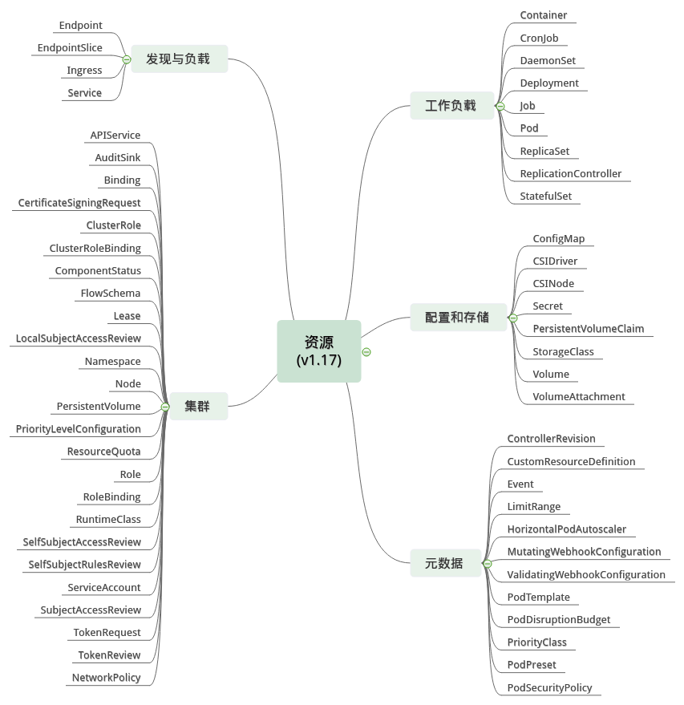

- 资源分为`集群`和`命名空间`两级作用域，命名空间级资源会在其命名空间删除时被删除。上图资源类别并不代表其作用域
- 所有资源在其资源对象模式(清单文件)中都有一个具体的表示形式，称为Kind。同一资源的多个对象(实例)可以组成集合

- 可以通过`kubectl api-resources`命令查看当前Kubernetes环境支持的所有资源的名称，缩写，api组，作用域及其对应的Kind

#### N.1.1.2 API

Kubernetes API大多数情况下遵循标准的HTTP REST规范，JSON和Protobuf是其主要序列化结构，资源通过API接口传入API Server最终持久化到Etcd数据库。API是由**API Server**组件提供服务，API Server是Kubernetes的管理中心，是唯一能够与Etcd数据库交互的组件.

##### N.1.1.2.1 API群组

Kubernetes API除了提供组织和管理各种资源的接口外，还包括一些系统层面的接口。目前API主要分为三种形式:

| 类型             | 描述                                                         | 路径                 | 清单字段示例      |
| ---------------- | ------------------------------------------------------------ | -------------------- | ----------------- |
| Core Group API   | 核心组API，包括Kubernetes中核心概念相关的API，如node，pod，service等 | /api/v1              | v1                |
| Named Groups API | 指定组API，包括各种非核心概念及自定义的API，如deployment，cronjob等 | /apis/GROUP/VERSION  | apps/v1，batch/v1 |
| System-wide API  | 系统级API，包括非Kubernetes资源相关的系统级API，如metrics，healthz等 | /metrics，/healthz等 |                   |

除了系统级API外，Kubernetes基本上是以**API Group(API群组)**的方式组织各种API的，核心组API并未使用/apis/core/v1路径是历史原因(事实上核心组也成为遗留组)。API群组是一组相关的API对象的集合，使用群组概念能够更方便的管理和扩展API。结构示意如下:

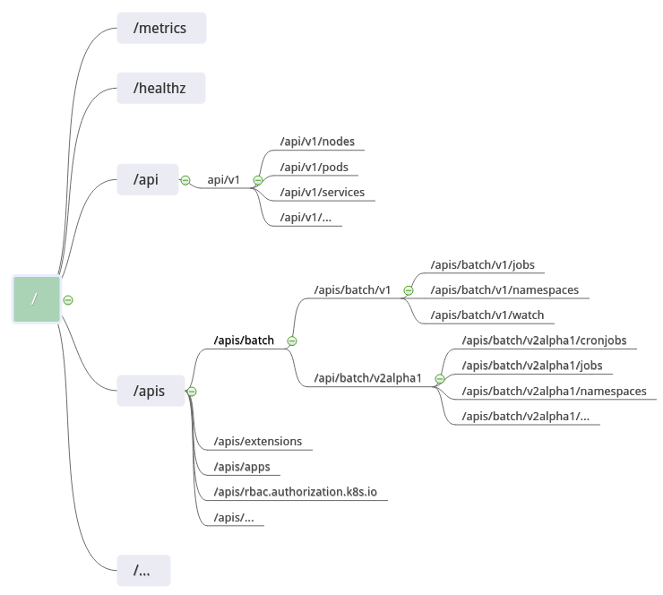

##### N.1.1.2.2 API版本

为了在兼容旧版本的同时不断升级新的API，Kubernetes支持多种API版本，不同的API版本代表其处于不同的稳定性阶段，低稳定性的API版本在后续的产品升级中可能成为高稳定性的版本。

API版本规则是通过基于API level选择版本，而不是基于资源和域级别选择，是为了确保API能够描述一个清晰的连续的系统资源和行为的视图，能够控制访问的整个过程和控制实验性API的访问。

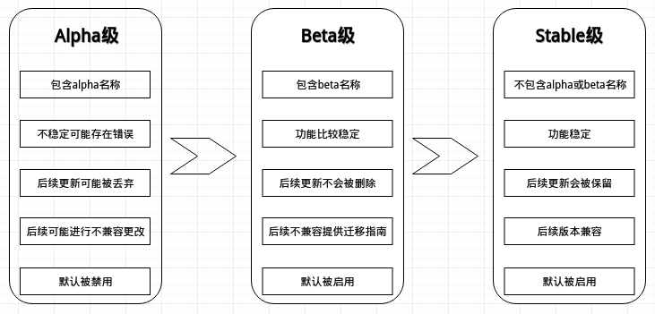

API通过这种三级渐进式版本共存与演化策略，在不断吸纳新的功能特性并给予其足够的孵化空间的同时，保证了整体API的可用性和稳定性。

- 资源定位三元组

> API Group，API Version和Resource(GVR三元组)就可以唯一确定一个资源的API路径。如`/apis/rbac.authorization.k8s.io/v1beta1/clusterroles`。
> 
> 对于命名空间级资源则需要额外包含具体命名空间(否则将请求所有命名空间下相应资源)，如`/apis/apps/v1/namespaces/kube-system/deployments`。
>
> 对应到资源对象模式(清单文件)三元组则为API Group，API Version和Kind(GVK)，相应字段为`apiVersion`和`kind`，如`{"apiVersion": "app/v1"，"kind": "Deployment"}`。

- Kubernetes组件默认启用加密通信，并需要请求者提供凭证，为了更方便地请求API，可以开启代理访问。

  ```bash
  kubectl proxy --port=8888   # 开启代理访问
  curl http://localhost:8888/api/pods/ # kubectl代理会自动使用默认凭证路径(/etc/kubernetes/ssl/)下的凭证文件(kube-proxy.xx)
  ```

- 可以通过`kubectl api-versions`命令查看当前Kubernetes环境启用的所有API群组及其版本。

#### N.1.1.3 数据持久化与无损转换

用户向Kubernetes发起资源构建请求时只提供了一个资源清单文件(如deployment.yaml)，但事实上Kubernetes基于可用性和稳定性的考虑，却能够支持同时使用不同稳定性的API版本访问同一资源，返回不同版本的资源数据。这一灵活的特性有赖于API Server的资源数据无损耗转换机制。

##### N.1.1.3.1 数据持久化

资源数据是持久化到Etcd数据库中的，而从资源清单文件到持久化到Etcd数据库的资源数据的大致流程如下:

1. 客户端(kubectl，curl，sdk等)得到资源清单文件(YAML或JSON格式)
2. 部分支持格式转换的客户端(如kubectl，sdk等)会先将YAML格式的资源清单文件转换为JSON格式化，然后根据清单字段或相应参数获取API Server 请求路径，发送到API Server
3. API Server对收到的资源清单文件进行准入校验和字段预处理，生成资源数据，对同资源的多个版本进行无损转换
4. API Server将资源数据转换为指定的存储版本
5. API Server将存储版本的资源数据按照指定编码(PROTOBUF或JSON)进行序列化，以key-value的方式存储到Etcd中

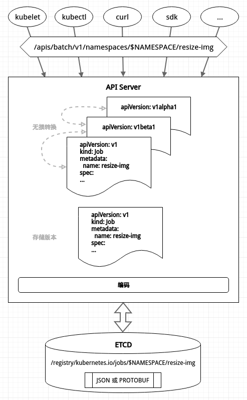

API Server启动时可以通过`--storage-versions`参数指定资源数据的存储版本(默认是最新稳定版，如v1); 通过`--storage-media-type`参数指定序列化编码(默认是application/vnd.kubernetes.protobuf)。

Etcd数据库中的资源数据是作为value存储的，而对应的key则是按照**/registry/#{k8s对象}/#{命名空间}/#{具体实例名}**的规范格式生成的。

##### N.1.1.3.2 无损转换

Etcd数据库中只存储了资源的一个指定版本，但客户端传入的资源清单文件中指定的资源版本和客户端向API Server请求的资源版本可能并不是Etcd数据库中存储的版本，API Server如何在各个版本之间进行无损转换呢?

如果一个资源存在众多版本，那么编写各种不同版本之间的转换规则无疑是非常麻烦的，因此API Server中维护着一个**internal**版本，需要作版本转换时，任意原版本都先转换为internal版本，再由internal版本转换到指定的目的版本，如此只要每个版本都可转换为internal版本，则可以支持任意版本之间的转换。

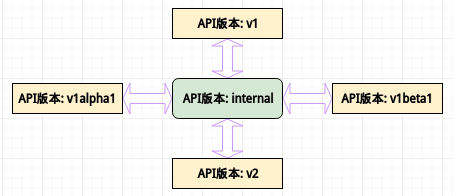

而保证版本转换过程中不出现数据丢失(即无损转换)则是依靠**annotations(注解)**实现。例如从版本A转换到版本B，对不同字段的处理如下:

- 版本A和B中均存在的字段可直接转换
- 版本A中存在而版本B中不存在的字段将写入注解中
- 版本A中不存在而版本B中存在的字段，如果存在于版本A的注解中则从注解中读取字段值，否则字段值置空

### N.1.2 API扩展

Kubernetes因其平台级基础设施的特殊性，与服务器，网络，存储，虚拟化，身份认证等等绝大多数计算机软硬件技术领域存在广泛交集，这需要大量的适配与对接，此外作为底层容器编排引擎，也需要满足高度的可扩展性以面对大量的功能特性扩展需求。

常规的解决方案是修改Kubernetes相关API和控制器的源代码或者定义新的资源类型并作为新的核心资源API合并到Kubernetes官方社区代码中。但这些方无疑会迅速使得Kubernetes核心API资源变得臃肿庞杂难以维护，最终导致API过载，这会为项目本身维护和产品生产环境运行的稳定性带来巨大挑战。

Kubernetes提供了两种API扩展机制保证核心API足够精简的同时满足庞杂的适配对接和特性扩展需求:

1. 自定义资源类型(CRD): 即CustomResourceDefinitions。允许用户通过资源清单的方式定义任意全新的资源对象类型，并由API Server管理自定义资源的整个生命周期，用户还可以通过定义相应的控制器对自定义资源及其他相关资源进行监视，协调和管理。通常将自定义资源和自定义控制器配合工作的方式统称为CRD方式。
2. API Server聚合(AA): 即API Server Aggregattion。其前身是用户API Server(UAS)，UAS允许用户设计一套自定义的API Server与Kubernetes主API Server并行生效，可以在不影响原API Server的前提下实现更加复杂和定制化的逻辑和功能，但这种方式对代码开发的要求会比较高。自定义API Server可以选择与主API Server进行聚合也可以独立存在，但独立存在的方式无法与Kubernetes很好的集成，因此自定义API Server普遍采用API Server聚合的方式。

#### N.1.2.1 自定义资源类型

Kubernetes原生支持自定义资源的创建和生命周期维护，自定义资源类型一经创建便与Pod，Job，Secret等内建资源拥有同等地位，可以像内建资源一样创建并运行自定义资源类型的实例对象。自定义资源配合定制的控制器就可以完成如自动化网络管理，自动化存储管理，自动化证书管理，自动化应用集群管理等广泛的特性需求。

##### N.1.2.1.1 自定义资源

**自定义资源类型的创建**

每个API资源都有相应的Group群组和资源类型，声明自定义资源就必须命名一个与已有群组不重复的新的Group群组，新的群组中可以有任意数量的自定义资源类型，并且这些资源类型可以与其他群组中的资源类型重名。

自定义资源类型的声明方式与Kubernetes的内建资源的创建方式相同，都是通过资源清单文件进行声明并应用，因为`CustomResourceDefinition`本身就是一种内建资源。一个最简单的自定义资源类型的声明清单示例如下:

```yaml
# apps-crd.yaml
apiVersion: apiextensions.k8s.io/v1beta1
kind: CustomResourceDefinition
metadata:
  name: apps.foo.bar
spec:
  group: foo.bar
  version: v1
  names:
    kind: App
    plural: apps
    scope: Namespaced
```

各字段解释如下:

- apiVersion: `CustomResourceDefinition`这一内建资源所在的群组及当前使用的api版本。目前为固定字段
- kind: 固定字段，表示是在声明自定义资源类型
- metadata.name: 自定义资源类型的全名，它由spec.group和spec.names.plural字段组合而成
- spec.group: 自定义资源类型所在群组
- spec.version: 自定义资源类型的群组版本
- spec.names.kind: 自定义资源的类型，惯例首字母大写
- spec.names.plural: 其值通常为kind的全小写复数，关系到自定义资源在REST API中的HTTP路径
- spec.names.scope: 表示自定义资源的作用范围，Kubernetes中大部分资源都是命名空间级(Namespaced)

自定义资源本身是不支持多版本的，但自定义资源的群组支持多版本。也就是说每一个群组的特定版本里的所有自定义资源都不需要考虑资源版本之间的兼容问题，保证群组内各资源的整体一致性。

spec.names中还有许多其他字段，不指定则会由API Server在创建自定义资源类型时自动填充.

自定义资源类型声明完成后就可以通过`kubectl create -f apps-crd.yaml`或`kubectl apply -f apps-crd.yaml`命令进行创建了，创建完成后可通过`kubectl get crd apps.foo.bar -o yaml`命令进行查看。

自定义资源类型创建完成后，其REST API的HTTP访问路径为`/apis/foo.bar/v1/namespaces/default/apps`(以default命名空间为例)。

**自定义资源的创建**

自定义资源类型创建完成后就可以创建相应的自定义资源。一个简单的自定义资源的创建清单如下:

```yaml
# app.yaml
apiVersion: foo.bar/v1
kind: App
metadata:
  name: demo
spec:
  port:     3333
  path: /app
```

自定义资源声明完成后就可以通过`kubectl create -f app.yaml`或`kubectl apply -f app.yaml`命令进行创建了，创建完成后可通过`kubectl get apps.foo.bar -o yaml`命令进行查看。

自定义资源创建完成后，其REST API的HTTP访问路径为`/apis/foo.bar/v1/namespaces/default/apps/demo`(以default命名空间为例)。

自定义资源spec下的字段只有在被特定控制器或应用按照约定的规范读取解析和处理后才具有实际意义.

> **终止器**
>
> 自定义资源和内建资源一样都可以支持终止器(finalizer)，终止器允许控制器实现异步的预删除钩子。
>
> 对于具有终止器的资源对象第一个删除请求仅仅是为`metadata.deletionTimestamp`字段设置一个值，而不是删除它，然后触发相应控制器执行自定义处理并删除该资源对象的终止器，最后再一次发出删除请求。
>
> 每个资源对象都可以有多个终止器，删除资源对象时，只有当其所有终止器都删除后才会真正被删除。

##### N.1.2.1.2 自定义控制器

在Kubernetes中，工作负载(workload)类的资源(如ReplicaSet，Deployment，StatefulSet，CronJob等运行容器的内建资源)是通过控制器(controller)进行管理的，这些控制器相当于一个状态机，用于控制对应Pod的具体状态和行为。

对于自定义资源，同样可以为其编写相应的控制器，进行资源数据的分析处理和Pod的状态行为控制。自定义资源和自定义资制器的配合使用才能创建，配置和管理复杂的有状态应用，真正提供声明式API服务，实现新特性的添加和Kubernetes API的扩展。

Kubernetes中控制器的主要工作模式如下:


控制器代码主要包括两部分:

- 客户端SDK: SDK是Kubernetes官方提供的开发工具包(sdk是golang编写，又称为client-go)，提供诸如Reflector，Delta FIFO queue，Thread safe Local store，Informer，Indexer，Workqueue等与API Server进行交互的通用组件
- 控制器特定内容: 根据特定控制器提供的特定功能而编写的相应回调函数和处理逻辑。这部分是编写自定义控制器的主要内容

控制器的完整工作流如下:

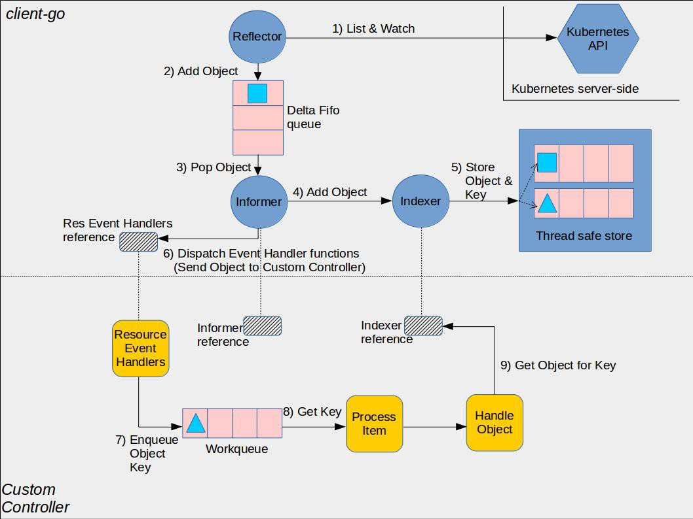

1. **Reflector反射器**通过List&Watch机制从API Server获取资源(包括内建资源和自定义资源)变化
2. Reflector将获取到的资源添加到**Delta FIFO队列**中
3. **Informer通知器**从Delta FIFO队列中弹出资源对象
4. Informer将得到的资源对象传递到**Indexer(索引器)**
5. Indexer为资源对象构建索引，以线程安全的方式将资源数据存储到线程安全的**Key-Value本地存储**中
6. Informer通过**Dispatch Event Handler事件分发处理函数**将资源对象的key发送到自定义控制器
7. 自定义控制器通过**Resource Event Handler资源事件处理函数**将资源对象key发送到**Workqueue工作队列**
8. **Process Item任务处理函数**从工作队列获取资源对象key并将其传递给**Object Handler资源对象处理函数**
9. 资源对象处理函数通过Indexer的引用从Key-Value本地存储中获取资源对象本身并进行处理

##### N.1.2.1.3 Operator和Kubebuilder

声明自定义资源并编写自定义控制器进行Kubenetes API扩展的方式对于代码开发有一定的要求。主要的工作内容如下:

- 初始化项目结构
- 定义自定义资源
- 编写自定义资源相关代码
- 初始化自定义控制器
- 编写自定义控制器相关代码(即业务逻辑)

这其中除了**定义自定义资源**和**编写业务逻辑**是需要针对具体需求单独开发外，其他内容都是通用的，可以自动化完成，因此社会和官方提供了一些CRD开发脚手架以帮助开发者无需了解复杂的Kubernetes API特性的情况下迅速构建Kubernetes扩展应用。目前比较流行的有两个:

- Operator Framework: CoreOS公司(目前属redhat旗下)开发和维护CRD快速开发框架。它包括**Operator SDK**和**Operator Lifecycle Manager**两部分，前者是Operator核心开发工具包，后者对Operator提供从安装，更新到运维的全生命周期管理
- Kubebuilder: Kubenetes社区兴趣小组开发和维护的CRD快速开发框架。提供与Operator类似的功能，但不支持Operator生命周期管理

Operator和Kubebuilder的实现原理和主要功能类似，二者均使用控制器工具和控制器运行时，封装结构类似，使用难易度相当，其主要区别如下:

- Operator SDK原生支持Ansible和Helm Operator; Kubebuilder不支持
- Operator SDK集成Operator Lifecycle Manager(OLM)，提供Operator全生命周期管理; Kubebuilder不支持
- Kubebuilder使用Makefile帮助用户完成操作员的任务(构建，测试，运行，代码生成等); Operator SDK当前使用内置子命令。Operator SDK团队将来可能会迁移到基于Makefile的方法
- Kubebuilder使用Kustomize来构建部署清单; Operator SDK使用带有占位符的静态文件
- Kubebuilder改善了对admission准入和CRD转换webhooks的支持; Operator SDK尚未支持

- Kubebuilder提供了更为完善的官方文档

鉴于Operator Framework的影响力 ，习惯性将基于CRD构建的Kubernetes应用称为Operator。相对于通过Helm Charts打包和部署Kubenetes应用的方式，Operator的自动化程度更高，更加符合云原生理念，因此越来越流行，目前越来越多的常用应用推出了自己的Operator，Kubernetes社区推出了[OperatorHub](https://www.operatorhub.io/)以供用户进行Operator的发布的使用。

#### N.1.2.2 API Server聚合

API聚合机制是Kubernetes 1.7版本引入的特性，能够将用户扩展的API注册到kube-apiserver（即Kubernetes核心API Server）上，仍然通过API Server的HTTP URL对新的API进行访问和操作。

API聚合机制的目标是提供集中的API发现机制和安全的代理功能，将开发人员的新API动态地、无缝地注册到Kubernetes API Server中进行测试和使用。为了实现这个机制，Kubernetes在kube-apiserver服务中引入了一个API聚合层（API Aggregation Layer），用于将扩展API的访问请求转发到用户服务的功能。

##### N.1.2.2.1 聚合层

API聚合层（API Aggregation Layer）在kube-apiserver进程内运行。在扩展API注册之前，聚合层不做任何事情。要注册API，用户必须添加一个APIService资源对象，用它来申领Kubernetes API中的URL路径。自此以后，聚合层将会把发给该 API 路径的所有内容（例如 /apis/myextension.mycompany.io/v1/…）代理到已注册的 APIService。

正常情况下，APIService 会实现为运行于集群中某Pod内的扩展API Server。如果需要对增加的资源进行动态管理，扩展API Server 经常需要和一个或多个控制器一起使用。聚合层支持多个自定义API Server对Kubernetes的API进行横向扩展。

扩展API Server与kube-apiserver之间的连接应具有低延迟。 发现请求应当在五秒钟或更短的时间内从kube-apiserver往返。可以在kube-apiserver上设置 `EnableAggregatedDiscoveryTimeout=false` 功能开关将禁用超时限制，但此开关将在将来的版本中被删除。

API聚合功能需要通过配置kube-apiserver服务的以下启动参数进行启用：

- --requestheader-client-ca-file=/etc/kubernetes/ssl_keys/ca.crt：客户端CA证书。
- --requestheader-allowed-names=：允许访问的客户端common names列表，通过header中--requestheader-username-headers参数指定的字段获取。客户端common names的名称需要在client-ca-file中进行设置，将其设置为空值时，表示任意客户端都可访问。
- --requestheader-extra-headers-prefix=X-Remote-Extra-：请求头中需要检查的前缀名。
- --requestheader-group-headers=X-Remote-Group：请求头中需要检查的组名。
- --requestheader-username-headers=X-Remote-User：请求头中需要检查的用户名。
- --proxy-client-cert-file=/etc/kubernetes/ssl_keys/kubelet_client.crt：在请求期间验证Aggregator的客户端CA证书。
- --proxy-client-key-file=/etc/kubernetes/ssl_keys/kubelet_client.key：在请求期间验证Aggregator的客户端私钥。

如果kube-apiserver所在的主机上没有运行kube-proxy，即无法通过服务的ClusterIP进行访问，那么还需要设置`--enable-aggregator-routing=true`。

##### N.1.2.2.2 扩展API Server

API聚合层提供了扩展API Server的动态注册、发现汇总、和安全代理，但是扩展API Server本身需要自行开发，并且需要遵循Kubernetes的开发规范。扩展API Server是以Kubernetes中的Pod的形式存在的，通常需要与一个或多个控制器一起使用。

官方提供了扩展API Server开发样例[sample-apiserver](https://github.com/kubernetes/sample-apiserver)，可以此为模板进行开发，但开发和部署步骤是非常繁琐的。好在可以使用第三方提供的开发框架如[apiserver-builder](https://github.com/kubernetes-incubator/apiserver-builder/blob/master/README.md)和[service-catalog](https://github.com/kubernetes-incubator/service-catalog/blob/master/README.md)，它们都同时提供了用于管理新资源的API框架和控制器框架，提供了一定的自动化支持。如使用apiserver-builder开发扩展API Server的关键步骤如下：

```bash
# 创建项目目录
mkdir $GOPATH/src/github.com/example/demo-apiserver
# 在项目目录下新建一个名为boilerplate.go.txt，里面是代码的头部版权声明
cd $GOPATH/src/github.com/example/demo-apiserver
curl -o boilerplate.go.txt https://github.com/kubernetes/kubernetes/blob/master/hack/boilerplate/boilerplate.go.txt
# 初始化项目
apiserver-boot init repo --domain example.com
# 创建一个非命名空间范围的api-resource
apiserver-boot create group version resource --group demo --version v1beta1 --non-namespaced=true --kind Foo
# 创建Foo这个api-resource的子资源
apiserver-boot create subresource --subresource bar --group demo --version v1beta1 --kind Foo
# 生成上述创建的api-resource类型的相关代码，包括deepcopy接口实现代码、versioned/unversioned类型转换代码、api-resource类型注册代码、api-resource类型的Controller代码、api-resource类型的AdmissionController代码
apiserver-boot build generated
# 直接在本地将etcd，apiserver，controller运行起来
apiserver-boot run local
```

##### N.1.2.2.3 APIService注册

扩展API Server是作为APIService注册到Kubernetes的核心API Server上的，启用API Server的聚合功能后就可以通过APIService资源对象注册API了。APIService资源清单文件如下：

```yaml
apiVersion: apiregistration.k8s.io/v1beta1
kind: APIService
metadata:
  name: v1beta1.customapi.k8s.io
spec:
  service:
    name: customapi
    namespace: custom
  group: customapi.k8s.io
  version: v1beta1
  insecureSkipTLSVerify: true
  groupPriorityMinimum: 100
  versionPriority: 100
```

上述清单文件中apiVersion和kind的值是固定的， metadata.name的值是由spec.version和spec.group的值拼接而来。APIService的API群组为customapi.k8s.io，版本为v1beta1，其API URL则为`/apis/customapi.k8s.io/v1beta1`。对应的后端扩展API Server为custom命名空间下的customapi服务，该服务将负载到运行扩展API Server的Pod上。

`kubectl create`命令创建成功后，通过Kubernetes API Server对``/apis/customapi.k8s.io/v1beta1``路径的访问都会被API聚合层代理转发到后端服务`customapi.custom.svc`上。

> Kubernetes内置的资源监控组件**[Metrics Server](https://github.com/kubernetes-incubator/metrics-server)**是一个典型的API聚合案例，可以通过它学习聚合API Server的开发和部署。

##### N.1.2.2.4 CRD与AA

**相同**

CRD和AA两种方式都是在保证API稳定性的前提下的API扩展方案，均支持横向扩展， 从实现上均采用了资源+控制器的模式提供声明式API服务，使用上二者提供了统一的访问方式，内部差异外部请求者是无感知的。此外，通过CRD或AA创建自定义资源时，与在Kubernetes平台之外实现它相比，能够提供诸如CRUD，通用元数据，通用客户端库，资源显示与字段编辑，内置认证授权模块等部分Kubernetes原生特性的支持：

**异同**

尽管存在诸多共通之处，但二者的扩展维度是截然不同的，CRD扩展的是API资源，直接复用Kubernetes核心API Server，属于轻量级扩展，这种方式简单易用，无论是代码开发还是部署维护都很方便快捷，但其功能特性受限于核心API Server，无法提供注入额外的认证授权和准入机制，无法使用其他存储层等。API Server聚合扩展的是API Server本身，允许设计并运行单独的API Server，与核心API Server并行生效，认证授权， 准入机制和存储层等的复用都是可选的，提供了更高级的API功能和更大的灵活性。

通常情况下建议采用CRD方式扩展API，CRD简单够用，开发维护难度和成本都远低于AA方式，除非必要不要考虑AA方式。

更多CRD和AA方式的比较可参考[官方文档](https://kubernetes.io/docs/concepts/extend-kubernetes/api-extension/custom-resources/#api-server-aggregation)。

## N.2 平台优化实践

不同的容器云平台解决方案在整体架构和实现上是存在差异的，对于平台稳定性的保障和优化方案也会因之而异。如OPENSHIFT容器云平台以一整个Kubernetes集群作为平台，而RANHCHER则通过单独的平台Server提供多种异构Kubernetes集群的纳管。但关系平台稳定性的核心问题都是Kubernetes集群的稳定性。对于Kubernetes集群的性能优化是保证集群稳定性的重要手段。

Kubernetes集群作为一种基础设施，其优化涉及到方方面面的内容，如api-server，etcd，kubelet等集群组件的优化，集群节点，网络和存储的优化等等。当集群到达一定规模的时候，一些细微优化往往能够让集群性能得到显著提升，从而降低各方面性能瓶颈影响集群稳定性的可能。

> 保证集群稳定性的另一个主要手段是对集群进行高可用设计，这部分内容将在单独章节中详细介绍，这里就不会过多涉及。

### N.2.1 组件优化

Kubernetes集群是通过api-server，etcd，kube-controller-manager,kubelet等一系列系统组件组织起来的，它们是集群的核心。这些组件提供了丰富调优参数和机制以满足不同的集群规模和系统环境。其整体架构如下：


- etcd: key-value数据库，存储整个集群的状态和数据
- kube-apiserver：资源操作的统一入口，并提供认证、授权、访问控制、API服务，API 注册和发现等机制
- kube-controller-manager：通过控制器维护集群资源的状态，比如故障检测、自动扩展、滚动更新等
- kube-scheduler：负责资源的调度，按照预定的调度策略将Pod调度到相应的机器上
- kubelet：负责维持容器的生命周期，同时也负责Volume（CVI和网络（CNI的管理
- kube-proxy：负责为Service提供cluster内部的服务发现和负载均衡

此外还有一些重要的如coredns，autoscaler等附加组件，对这些核心组件的优化是Kubernetes集群优化的关键。除etcd外，其他组件都是无状态的，为这些组件设计高可用架构可以提高组件的负载能力和组件服务的稳定性。由于高可用将使用单独的章节展开，因此下文关于各组件的优化内容将不对高可用部分作赘述。

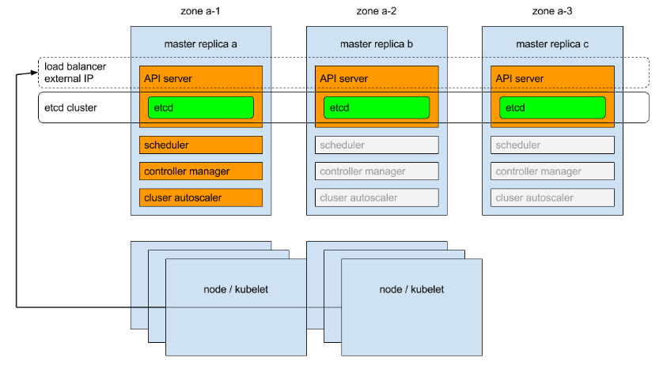

#### N.2.1.1 etcd优化

etcd是整个Kubernetes集群的集群数据的分布式存储数据库，所有集群数据都是通过api-server对etcd进行读写，etcd的读写性能对整个集群性能的影响是立竿见影的。

决定etcd性能的关键因素是**延迟（latency）**和**吞吐量（throughput）**。延迟是完成一次操作所需的时间，吞吐量是一个时间段内能够完成操作的总数。通常情况下，一个三节点的etcd集群在轻负载下可以在低于1ms内完成一个请求，并在重负载下每秒可以完成30000个请求。

etcd基于Raft一致性算法完成节点数据同步的，一致性性能受限于**网络IO延迟**和**磁盘IO延迟**。完成一个etcd请求的最小时间是节点之间的网络往返时延(Round Trip Time / RTT)和需要提交数据到持久化存储的 fdatasync 时间之和。吞吐量方面，etcd会将多个请求打包在一起再进行分发以提高重负载下的吞吐量。

##### N.2.1.1.1 网络IO延迟优化

1. Etcd底层的分布式一致性协议依赖两个时间参数来保证节点之间能够在部分节点掉钱的情况下依然能够正确处理主节点的选举。第一个参数是**心跳间隔（heartbeat interval）**，即主节点通知从节点它还是领导者的频率。实践数据表明，该参数应该设置成节点之间 RTT 的时间。Etcd的心跳间隔默认是 100 毫秒。第二个参数是**选举超时时间（election timeout）**，即从节点等待多久没收到主节点的心跳就尝试去竞选领导者。选举超时必须至少是RTT 10 倍的时间以便对网络波动，Etcd的选举超时时间默认是 1000 毫秒。

   实际环境尤其是跨数据中心部署etcd集群时，由于网络延迟可能会很高，因此需要根据实际网络情况对etcd的心跳间隔和选举超时时间进行相应调整。调整方法如下：

   ```bash
   # 通过命令行参数
   etcd --heartbeat-interval=100 --election-timeout=1000
   # 通过环境变量
   ETCD_HEARTBEAT_INTERVAL=100 ETCD_ELECTION_TIMEOUT=1000 etcd
   ```

2. 如果Etcd的leader节点要处理大规模并发的客户端请求，就有可能因为网络拥塞的原因延迟对follower节点的响应。在Linux上可以用tc工具调整网络带宽和优先级：

   ```bash
   tc qdisc add dev eth0 root handle 1: prio bands 3
   tc filter add dev eth0 parent 1: protocol ip prio 1 u32 match ip sport 2380 0xffff flowid 1:1
   tc filter add dev eth0 parent 1: protocol ip prio 1 u32 match ip dport 2380 0xffff flowid 1:1
   tc filter add dev eth0 parent 1: protocol ip prio 2 u32 match ip sport 2379 0xffff flowid 1:1
   tc filter add dev eth0 parent 1: protocol ip prio 2 u32 match ip dport 2379 0xffff flowid 1:1
   ```

##### N.2.1.1.2 磁盘IO延迟优化

1. 优化磁盘IO最直接有效的方式就是使用SSD磁盘。鉴于etcd的高读写需求，应尽量将etcd运行在本地SSD磁盘的节点上，集群规模较大时尤其不建议对etcd使用网络磁盘。

2. etcd的存储目录分为snapshot和wal，他们写入的方式是不同的，snapshot是内存直接dump file。而wal是顺序追加写，对于这两种方式系统调优的方式是不同的，snapshot可以通过增加IO平滑写来提高磁盘IO能力，而wal可以通过降低pagecache的方式提前写入时序。因此对于不同的场景，可以考虑将snap与wal放在不同的磁盘上，提高整体的IO效率，这种方式可以提升etcd 20%左右的性能。

3. etcd底层的存储引擎boltdb采用了MVCC机制，会把一个key的所有update历史都存储下来，所以相关数据文件会线性增长，这会加重etcd的数据加载负担并降低集群的性能，因此默认情况下每10,000个update后etcd会创建一个snapshot实现日志压缩。如果etcd的内存使用和磁盘使用过高，那么应该尝试调低快照触发的阈值：

   ```bash
   # 通过命令行参数
   etcd —snapshot-count=5000
   # 通过环境变量
   ETCD_SNAPSHOT_COUNT=5000 etcd
   ```

4. etcd需要把log实时写入磁盘，所以其他IO密集型进程可能会提高etcd进程的写延迟，导致心跳超时、处理请求超时、成员失联等问题。可以通过ionice命令提高etcd进程的磁盘操作优先级：

   ```bash
   ionice -c2 -n0 -p `pgrep etcd`
   ```

5. etcd默认的请求大小限制是1.5MiB，存储总量限制是2GiB，前者过大会导致磁盘IO延迟增加，后者过小将导致etcd不可用，可以根据实际情况对这两个限制进行修改：

   ```bash
   etcd --max-request-bytes=1048576 --quota-backend-bytes=8589934592
   ```

6. 此外，可以考虑将etcd集群部署到Kubernetes集群外的独立节点上，以最大化利用节点性能。

#### N.2.1.2 kube-apiserver优化

kube-apiserver是Kubernetes集群的核心组件，为集群提供API服务，是其他所有组件和外部请求的唯一入口，也是读写etcd的唯一途径。apiserver对整个集群的性能和稳定性具有举足轻重的影响。

1. 设置`--apiserver-count` 和 `--endpoint-reconciler-type`，可使得多个kube-apiserver实例加入到Kubernetes Service的endpoints中，从而实现高可用。

2. 设置`--max-mutating-requests-inflight `和`--max-requests-inflight` ，控制可变和不可变请求连接数（指请求进入apiserver后是否可以被加工）。默认是 200 和 400。 节点数量在 1000 - 3000 之间时，推荐：

   ```bash
   --max-requests-inflight=1500
   --max-mutating-requests-inflight=500
   ```

   节点数量大于 3000 时，推荐：

   ```bash
   --max-requests-inflight=3000
   --max-mutating-requests-inflight=1000
   ```

3. 对不同的object进行分库存储，首先应该将数据与状态分离，即通过apiserver的`--etcd-servers-overrides`参数将events放在单独的etcd实例中，后期可以将 pod、node 等 object 也分离在单独的 etcd 实例中：

   ```bash
   --etcd-servers="http://etcd1:2379,http://etcd2:2379,http://etcd3:2379" --etcd-servers-overrides="/events#http://etcd4:2379,http://etcd5:2379,http://etcd6:2379"
   ```

4. 设置`--target-ram-mb`配置缓存相关的apiserver内存大小，计算公式：

   ```bash
   --target-ram-mb=node_nums * 60
   ```

#### N.2.1.3 kube-controller-manager优化

kube-controller-manager作为集群内部的管理控制中心，负责集群内的Node、Pod副本、服务端点（Endpoint）、命名空间（Namespace）、服务账号（ServiceAccount）、资源定额（ResourceQuota）、弹性伸缩（AutoScaling）等的管理。Controller Manager关系到各种资源的状态能否正常维持。

1. kube-controller-manager可以通过`leader election`实现高可用：

   ```bash
   --leader-elect=true
   --leader-elect-lease-duration=15s
   --leader-elect-renew-deadline=10s
   --leader-elect-resource-lock=endpoints
   --leader-elect-retry-period=2s
   ```

2. 设置与kube-apiserver通信的qps：

   ```bash
   --kube-api-qps=100 # 每秒向apiserver查询的次数
   --kube-api-burst=150 # 每秒向apiserver查询的次数上限
   ```

3. 禁用不需要的controller，kubernetes中存在几十个controller，默认启动为`--controllers`，即启动所有controller，可以禁用不需要的controller。
4. 调整controller同步资源的周期，避免过多的资源同步导致集群资源的消耗，所有带有`--concurrent`前缀的参数都可调节。
5. controller-manager 中存储的对象非常多，每次升级过程中从apiserver获取这些对象并反序列化的开销可能导致几分钟的集群功能中断，可以通过预启动备controller的informer预先加载所需数据，在主controller升级时主动释放`Leader Lease`触发备controller立即接管工作。

#### N.2.1.4 kube-scheduler优化

kube-scheduler是Kubernetes集群的默认调度器，调度器负责依据资源需求，策略约束，亲和性规则，数据位置，工作负载间干扰和最后时限等调度原则对Pod做出合适的调度选择。合理的调度能够在兼顾应用部署效率的同时保证整个集群各节点提供平稳的服务。

1. kube-scheduler可以通过leader election实现高可用：

   ```bash
   --leader-elect=true
   --leader-elect-lease-duration=15s
   --leader-elect-renew-deadline=10s
   --leader-elect-resource-lock=endpoints
   --leader-elect-retry-period=2s
   ```

2. 设置与kube-apiserver通信的qps：

   ```bash
   --kube-api-qps=100 # 每秒向apiserver查询的次数
   --kube-api-burst=150 # 每秒向apiserver查询的次数上限
   ```

3. 合理利用默认调度器的`Pod/Node Affinity & Anti-affinity`, `Taint & Toleration`, `Priority & Preemption`和` Pod Disruption Budget`等特性。
4. 根据需要通过`schduler_extender`扩展默认调度器。
5. 根据具体场景需求编写特定调度器并在Pod中指定通过`spec.schedulerName`字段所使用的调度器。
6. 使用`Descheduler`提供动态调度支持，使集群各节点保持动态平衡状态。

#### N.2.1.5 kubelet优化

kubelet是Kubernetes中的节点代理，运行在每个节点上，与容器运行时，网络和存储插件交互，负责提供Pod管理，容器健康检查和资源监控等工作。

1. 设置单节点允许运行的最大Pod数量，默认是110个：

   ```bash
   --max-pods=110
   ```

2. 配置允许并行拉取镜像：

   ```bash
   --serialize-image-pulls=false
   ```

3. 设置镜像拉取超时时间。默认值1分钟，对于大镜像拉取需要适量增大超时时间：

   ```bash
   --image-pull-progress-deadline=30
   ```

4. 设置与kube-apiserver通信的qps：

   ```bash
   --kube-api-qps=100 # 每秒向apiserver查询的次数
   --kube-api-burst=150 # 每秒向apiserver查询的次数上限
   ```

5. 使用`node lease`减少心跳上报频率，让kubelet使用轻量级的nodeLease对象作为更新请求代替老的Update Node Status方式，减轻apiserver负担。本特性在v1.16版本后默认启用。

6. 使用`bookmark`机制告知apiserver只watch特定bookmark的事件，减轻apiserver负担。本特性v1.15版本后默认启用。

7. kubelet 拥有节点自动修复的能力，例如在发现异常容器或不合规容器后，会对它们进行驱逐删除操作，此默认行为可能存在风险，可以通过设置`--eviction-hard=`限制其自动驱逐能力。

#### N.2.1.6 kube-proxy优化

kube-proxy是集群中每个节点上运行的网络代理，负责维护节点上的网络规则。这些网络规则控制网络流量的路由转发并实现负载均衡，从而允许从集群内部或外部的网络会话与Pod进行网络通信。

kube-proxy有三种运行模式：`userspace`，`iptables`，`ipvs`。其中userspace在用户态完成流量转发，效率低下已经不建议使用。kube-proxy当前使用的是iptables模式，iptables是Linux内核功能，更加简单高效，但其负载算法单一，且通过规则遍历完成匹配，随着集群规模的增长，性能损失是可预见的。ipvs是用于负载均衡的Linux内核功能，基于哈希表的规则匹配使得它的性能几乎不受集群规模的影响，而且能够提供更多样化的负载均衡算法。

kube-proxy的主要优化方案就是将默认运行模式替换为ipvs模式。通常在服务（Kubernetes中的Service）规模超过5000的情况下，在响应时间和CPU用量上ipvs会出现明显的优势。

#### N.2.1.7 coredns优化

coredns是Kubernetes内默认的域名解析服务，它并不是系统组件的一部分，可以运行在Node节点上，并通过`Service`向集群内部提供服务。

1. coredns默认配置只会运行一份实例，在其升级或是所在节点宕机时，会出现集群内部dns服务不可用的情况，严重时会影响到线上服务的正常运行。为了避免故障，可以将coredns的`replicas`值设为2或者更多，并用`anti-affinity`将他们部署在不同的Node节点上。

2. Kubernetes为Pod提供了四种DNS策略：

   - None：允许Pod忽略Kubernetes环境中的DNS设置

   - Default：Pod从运行所在的节点的DNS服务进行域名解析

   - ClusterFirst：默认策略，让Pod首先使用集群DNS服务进行域名解析，解析不成功才使用所在节点的DNS配置解析

   - ClusterFirstWithHostNet：以nostNetwork模式运行的Pod使用集群DNS服务解析域名解析

​      由于默认使用ClusterFirst策略，而集群DNS进行域名解析时会利用search和ndots特性对域名进行逐个拼接解析，部分场景下可以通过Pod的`dnsPolicy`字段更改默认的DNS策略或者通过Pod的`dnsConfig`字段更改ndots值避开集群DNS解析的默认规则。

### N.2.2 节点优化

在Kubernetes中，节点（Node）是执行工作的机器。节点可以是虚拟机也可以是物理机。每个节点都包含用于运行 Pod的必要服务，并由主控组件管理。节点上的服务包括容器运行时、kubelet和kube-proxy。

通过对集群规模和节点性能的评估以及操作系统和Kubernetes组件的相关参数的优化，可以为Kubernetes提供必要的特性支持，更好地发挥节点性能，降低因节点资源紧张而影响集群性能和稳定性的风险。

#### N.2.2.1 节点基础环境优化

为了获得更稳定的性能体验和更便捷的资源管理，作为Kubernetes集群工作节点的服务器建议在操作系统，CPU内存容量和系统参数等方面进行一定的优化。

1. 操作系统选择

   Kubernetes集群对节点操作系统没有硬性要求，主流的Linux发行版都是可用的，但要求内核版本为3.10以上（旧内核在容器兼容性上存在bug），推荐的发行版是RHEL 7.8+，CentOS 7.8+以及Debain buster和Ubuntu 18.04。Kubernetes自v1.14版本以后，已经支持生产级的Windows节点，但处于性能和特性兼容方面的考虑，如非必需，不应考虑Windows节点。

   部分厂商为容器化定制了专用操作系统，如RancherOS，CoreOS（RHOS）等，这些操作系统提供了比较完整的容器环境支持，但剔除了任何不必要的软件和服务，甚至对系统结构作了一定程度的改造，以最大化利用主机资源，提供云原生特性支持，但对主机的集中管理带来了一定的不便，需要酌情考虑是否使用。

2. 节点容量规划

   Kubernetes并不要求工作节点统一配置，但规划一个通用的CPU内存配置是必要的，一方面便于管理，另一方面主机模板化后也方便进行动态扩缩容。**少量大节点**和**大量小节点**的容量规划理念各有优劣，需要根据实际需求和客观条件进行规划。

   少量大节点理念优点：

   - 减少管理成本：管理少量主机比管理大量主机更省力，更新和补丁可以更快地应用，预期的故障数量也会更少
   - 节点成本更低：通常一个大节点比同配置的多个小节点成本更低廉
   - 应用适配度高：允许允许诸如ElasticSearch等资源要求高的应用

   少量大节点理念缺点：

   - 单节点Pod数量多：高配置的单节点意味着更多的Pod会被调度上去，这会为Kubernetes运行在节点上的代理带来更大的开销，如容器常规检测和信息收集活动需要更多的时间。官方建议每个节点最多运行110个Pod, 低于此值的Pod数量应当不会对代理组件产生明显影响
   - 更大的爆破半径：少量的大节点意味着一旦节点故障将可能影响更多的应用，导致大量的Pod重新部署
   - 弹性伸缩增量大：Kubernetes支持集群节点的弹性伸缩，大节点意味着弹性伸缩时会有较大的伸缩量，这可能导致资源浪费

   大量小节点理念优点：

   - 较小的爆破半径：大量小节点意味着节点故障影响的应用会比较少
   - 弹性伸缩增量平稳：节点的弹性伸缩增量比较平稳，资源浪费少

   大量小节点理念缺点：

   - 节点数量大：大量节点对Kubernetes控制平面而言可能是个挑战。尽管官方声称单集群支持的节点上限为5000，但实际上规模达到500个节点就会需要额外的优化
   - 系统开销大：每个节点都需要运行一组守护进程，越多的节点意味着越多的系统资源被守护进程占用

   我们可以根据实际业务需求，建设成本投入和集群规模预估等因素制定相对折中的容量规划。一般容量为`8 Core & 16GB内存`到`64 Core & 128GB内存`的节点通用性更高。

   此外，根据应用的特定需求如CPU密集，IO密集，GPU需求，操作系统要求等定制多套不同的容量规范也是推荐做法。
   
3. 系统参数配置

   修改节点的系统内核参数以满足集群需求，最大化利用节点资源，编辑`/etc/sysctl.conf`文件：

   ```bash
   fs.file-max=1000000
   # max-file 表示系统级别的能够打开的文件句柄的数量， 一般如果遇到文件句柄达到上限时，会碰到"Too many open files"或者Socket/File: Can’t open so many files等错误。
   
   net.ipv4.ip_forward=1
   # 开启路由转发功能
   
   # 配置arp cache 大小（以下三个参数，当内核维护的arp表过于庞大时候，可以考虑优化）
   net.ipv4.neigh.default.gc_thresh1=1024
   # 存在于ARP高速缓存中的最少层数，如果少于这个数，垃圾收集器将不会运行。缺省值是128。
   
   net.ipv4.neigh.default.gc_thresh2=4096
   # 保存在 ARP 高速缓存中的最多的记录软限制。垃圾收集器在开始收集前，允许记录数超过这个数字 5 秒。缺省值是 512。
   
   net.ipv4.neigh.default.gc_thresh3=8192
   # 保存在 ARP 高速缓存中的最多记录的硬限制，一旦高速缓存中的数目高于此，垃圾收集器将马上运行。缺省值是1024。
   
   net.netfilter.nf_conntrack_max=10485760
   # 允许的最大跟踪连接条目，是在内核内存中netfilter可以同时处理的“任务”（连接跟踪条目）
   net.netfilter.nf_conntrack_tcp_timeout_established=300
   net.netfilter.nf_conntrack_buckets=655360
   # 哈希表大小（只读）（64位系统、8G内存默认 65536，16G翻倍，如此类推）
   net.core.netdev_max_backlog=10000
   # 每个网络接口接收数据包的速率比内核处理这些包的速率快时，允许送到队列的数据包的最大数目。
   
   fs.inotify.max_user_instances=524288
   # 默认值: 128 指定了每一个real user ID可创建的inotify instatnces的数量上限
   
   fs.inotify.max_user_watches=524288
   # 默认值: 8192 指定了每个inotify instance相关联的watches的上限
   ```

   让配置生效：

   ```bash
   sysctl -p
   ```

   不同的容器云平台的调优参数可能有所不同。

   此外，OPENSHIFT容器云平台还提供`Node Tuning Operator`通过`tuned`守护进程自动管理节点性能优化。Node Tuning Operator为用户提供了一个统一的节点级sysctls管理接口，并可以根据具体用户的需要灵活地添加定制的性能优化设置。

4. 其他事项

   Kubernetes自v1.6版以后的节点和容器支持上限如下：

   - 不超过 5000 个节点
   - 不超过 150000 个Pod
   - 不超过 300000 个容器
   - 每台节点不超过 110 个Pod

   对于公有云上的Kubernetes集群，还应当根据集群规模提前增大相关配额：

   - 虚拟机个数
   - vCPU 个数
   - 内网 IP 地址个数
   - 公网 IP 地址个数
   - 安全组条数
   - 路由表条数
   - 持久化存储大小

#### N.2.2.2 master节点优化

master节点上运行着Kubernetes的集群控制平面相关组件（kube-apiserver，kube-controller-manager，kube-scheduler)，这些组件对集群进行全局决策（例如，调度），并检测和响应集群事件。理论上这些组件可以运行在集群任何节点上，但简单起见一套控制平面组件通常会运行在同一个节点上。控制平面管理整个集群，负载压力巨大且影响整个集群的状态，因此运行这些组件的master节点需要进行特别优化。

1. 由于master节点管理和控制整个集群，随着集群规模的扩大，master节点的压力也会增加，因此需要为master节点规划相匹配的CPU和内存配置规格。

   集群节点规模和master节点规格参照（etcd运行在master节点）如下：

   | 节点规模      | Master CPU核心 | Master 内存 |
   | ------------- | -------------- | ----------- |
   | 1-5个节点     | 4              | 8GB         |
   | 6-20个节点    | 4              | 4C16G       |
   | 21-100个节点  | 8              | 32GB        |
   | 100-200个节点 | 16             | 64GB        |
   | 200-500个节点 | 32             | 128GB       |
   | 500个节点以上 | 64             | 256GB       |

​      不同的容器云平台规格参数可能有所不同。

2. etcd数据库默认也运行在master节点上，由于etcd会产生大量的资源占用，建议将etcd运行在额外的服务器上，避免与控制平面组件争抢资源。

3. master节点本质上也是工作节点，同样也能够在其上部署业务Pod，建议为master节点打上不可调度污点，防止业务Pod被调度到master节点上挤占控制平面组件资源。master节点默认会添加此污点。

#### N.2.2.2 worker节点优化

工作节点是运行工作负载（即应用Pod）的节点，除了常规的基础环境优化外，还应当视集群规模需求进行一些工作负载相关的优化。

1. 限制节点上可部署的Pod数量。节点运行太多Pod会影响节点性能，减慢Pod调度速度，影响应用性能。Kubernetes通过kubelet的`--pods-per-core`和`--max-pods`参数限制节点上每个CPU核心可分配的Pod数量和整个节点上可运行的Pod的数量，两个参数都被设置时，其中较小的值决定真正的限制数量。`--max-pods`的默认值是110。

2. 除了硬性限制外，kubernetes平台还存在一些软性的性能指标上限，即如果集群指标超过这些上限值，虽然不会导致集群不可用，但会显著降低集群的整体性能。因此需要尽量避免接近这些上限值。

   | 限制类型                     | 指标上限 |
   | ---------------------------- | -------- |
   | 节点数量                     | 2000     |
   | Pod数量                      | 150000   |
   | 每个节点Pod数量              | 250      |
   | 命名空间数量                 | 10000    |
   | 每个命名空间Pod数量          | 25000    |
   | Service数量                  | 10000    |
   | 每个命名空间Service数量      | 5000     |
   | 每个服务的后端Pod数量        | 5000     |
   | 每个命名空间的Deployment数量 | 2000     |

3. 重新设置插件配额和副本数。很多Kubernetes集群插件被广泛使用，这些插件在部署时已经设定了CPU和内存配额和副本数量，并且不会自动改变。当集群规模扩大时，这些插件可能需要更多CPU和内存资源或者副本才能正常运行提供服务，因此在集群规模变化时要注意对集群插件的这些配置进行相应的手动更新，避免插件Pod负载压力过大或者达到资源配额限制而不断被杀死重建，影响集群性能和插件的正常服务。

4. 配置节点容量预留。节点上的资源（包括CPU，内存，临时存储和PID等）被Kubernetes视为**容量（Capacity）**，默认情况下，Pod可以消耗节点上所有可用的容量，因此可能导致Pod与节点上的操作系统和Kubernetes守护进程争抢资源，影响节点性能。

   可以通过Kubernetes的`Node Allocatable`特性配置节点的容量预留，避免应用Pod消耗掉节点上的所有资源。

   Kubernetes将节点容量分为以下几个部分：

   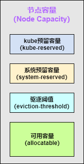

   可用容量（allocatable）才是应用Pod真正可以使用的容量，其计算方法是：

   ```bash
可用容量 = 节点容量 - kube预留容量 - 系统预留容量 - 驱逐阈值
   ```
   
   - kube-reserved：kube-reserved是为了给诸如 `kubelet`、`container runtime`、`node problem detector` 等kubernetes系统守护进程争取资源预留。但这并不代表要给以Pod形式运行的系统守护进程保留资源。
   
     要在系统守护进程上执行 `kube-reserved`，需要把kubelet的 `--kube-reserved-cgroup` 标志的值设置为kube守护进程的父控制组，如`kubelet.service`

     ```bash
     
     ```
  # kubelet参数设置kube资源预留
     --kube-reserved=[cpu=100m][,][memory=100Mi][,][ephemeral-storage=1Gi][,][pid=1000]
  --kube-reserved-cgroup=/kubelet.service
     ```

   - system-reserved：system-reserved用于为诸如 `sshd`、`udev` 等系统守护进程争取资源预留。 system-reserved也应该为 `kernel` 预留 `内存`，因为目前 `kernel` 使用的内存并不记 Kubernetes的Pod上。 同时还推荐为用户登录会话预留资源。
   
     要想在系统守护进程上执行 `system-reserved`，需要把kubelet的 `--system-reserved-cgroup`  标志的值设置为OS系统守护进程的父级控制组，如`system.slice`

     ```bash
     
     ```
  # kubelet参数设置系统资源预留
     --system-reserved=[cpu=100m][,][memory=100Mi][,][ephemeral-storage=1Gi][,][pid=1000]
     --system-reserved-cgroup=/system.slice
     ```

- eviction-threshold：eviction-threshold预留容量后，将在节点可用容量不足该阈值时，尝试驱逐Pod。驱逐阈值只支持 `memory` 和 `ephemeral-storage`，且其预留的容量不能为Pod所用。
  
  ```bash
     # kubelet参数设置驱逐阈值
  --eviction-hard=[memory.available<500Mi]
  ```
  
   此外Kubernetes还提供了如下相关参数：
  
- reserved-cpus：reserved-cpus显式指定为操作系统和Kubernetes守护进程预留哪几个CPU资源，此选项在 kubernetes 1.17 版本中添加。
  
  ```bash
     # kubelet参数设置保留CPU
     --reserved-cpus=0-3
  ```
  
- enforce-node-allocatable：enforce-node-allocatable指定为哪些对象启用容量预留，默认支持Pod
  
  ```bash
     # kubelet参数设置容量预留启用对象
     --enforce-node-allocatable=pods[,][system-reserved][,][kube-reserved]
  ```
  
   - cgroup-driver：cgroup-driver指定使用的cgroup驱动，默认为`cgroupfs`，另一可选项为`systemd`。kubelet使用的cgroup driver需要与容器运行时使用的cgroup driver一致
  
   - cgroups-per-qos：启用QoS和Pod级别的cgroup，开启后，kubelet会将管理所有workload Pods的cgroups。此参数默认是开启的

### N.2.3 网络优化

网络是Kubernetes中的核心部件，Kubernetes对集群网络进行了重新抽象，以实现整个集群网络的扁平化。网络规划和性能表现关系到集群内系统组件，应用容器之间能否正常高效地通信，也关系到集群对外服务的可用性和服务质量。合理的网络优化不仅能够有效维护集群状态，更能够为集群和集群内应用的对外服务提供强有力的质量保障。

#### N.2.3.1 Kubernetes网络模型

Kubernetes网络基于容器网络技术。容器网络利用网络命名空间内核特性实现网络隔离，再通过网桥，iptables，overlay等技术实现容器间通信。典型的Docker容器运行时提供了如下四种网络模式：

- None模式：容器独立网络命名空间，不分配虚拟网络设备也不提供对外连接
- Container模式：同主机容器间共享网络命名空间，容器间网络配置一致，可以通过localhost通信
- Host模式：容器和宿主机共享网络命名空间，容器和宿主机网络配置一致，可以通过localhost通信
- Bridge模式：默认模式，主机通过虚拟网桥设备和veth pair为主机和主机所有容器提供网络桥接实现互通

对于跨主机容器间通信，需要利用虚拟网桥配合额外的技术实现，主要有overlay和underlay两种模式，每种模式又有多种网络方案，这些网络方案遵循CNI（容器网络接口）规范，能够适配所有兼容CNI的容器运行时。

Kubernetes对网络进行抽象，将其划分为四个层面：

1. 高耦合容器间的网络通信，也就是Pod内部的容器间网络通信
2. 集群内Pod到Pod之间的网络通信
3. 集群内Pod到Service之间的网络通信
4. 集群外部到集群内部的网络通信，也就是集群外部到Service的网络通信

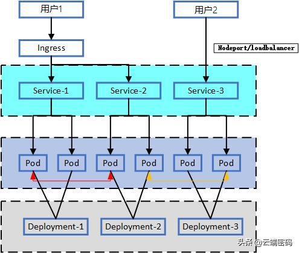

Pod内容器通信利用Linux内核的网络命名空间特性实现。

集群内Pod间网络通信则需要借助网络插件，Kubernetes本身是不负责为Pod提供和管理网络的，而是由kubelet调用网络插件进行相应配置，然后由容器运行时通过CNI调用网络插件为Pod进行自动的网络配置。网络插件除了为Pod配置网络外，还通常需要提供IP统一分配与管理，跨主机Pod通信等功能。不同的网络插件实现方式，网络特性和适用条件都是不同的，因此需要根据实际的集群情况选择合适的网络插件，这是Kubernetes网络优化的重点，下文将详细介绍。

集群内Pod到Service的通信是Kubernetes利用Linux内核的iptables路由转发功能配合kube-proxy监听apiserver并编辑本机iptables规则实现的Pod网络流量负载机制。Service机制在kube-proxy优化中有介绍，后文还会具体说明。Service层面主要的网络优化手段是前文提到的将kube-proxy的iptables模式替换为ipvs模式，不再赘述。

集群外部到集群内部的通信称为集群网络入口，入口方案存在多种实现方案，有的方案是Kubernetes集群原生支持的，但是存在局限性，有的方案需要单独的控制器和负载均衡器，能够提供更强大的功能，但此类方案也存在多种实现，各有优劣，需要根据实际需求进行选择，这也是Kubernetes网络优化的重点，下文将详细介绍。

#### N.2.3.2 网络插件选型

Kubernetes中Pod的网络自动配置管理以及Pod间跨主机通信需要使用单独的网络插件实现。网络插件分为两类：

- kubenet：这是Kubernetes的默认网络插件，它创建具有IP范围的虚拟网桥，然后在每个主机上手动添加主机之间的路由，这种方式功能单一，自动化程度低，通常不会选择它
- CNI插件：CNI插件基于通用的容器网络接口，可以自动生成基本配置，让网络的创建和管理变得更加容易。它是网络供应商、项目与 Kubernetes集成的标准方法。

CNI插件的核心功能是解决Pod跨主机通信的问题，有很多不同的实现方案，从网络结构和实现技术上看，主要分为二层转发和三层转发两种。二层转发需要进行网络封包和解包，称为overlay网络，三层转发直接利用现有网络协议，称为underlay网络。性能上underlay方案会优于overlay方案。当然不同实现方案在易用性，安全性，资源消耗，功能特性等方面也会有所不同。

主流的CNI网络插件有：

- Flannel: 

  flannel是CoreOS公司为容器跨主机通信提供的overlay网络方案，它也是最老牌最成熟的Kubernetes网络插件。flannel通过VxLAN，UDP等方式将二层网络包封装到三层网络包中，借助宿主机的三层网络将包转发到目的容器的宿主机上，再通过解包将网络包转发到正确的容器上。UDP方式在用户态完成封包解包操作，VxLAN在内核态完成，因此VxLAN性能比UDP好很多，通常选择flannel vxlan模式，其网络性能损耗在10%左右。

  使用flannel网络插件的Kubernetes集群会在初始化时指定一个16位掩码的网段，默认情况下集群中每个节点会被分配一个24位掩码的网段，因此集群中最多可以有255个节点，每个节点上最多可以有253个Pod（其他地址被系统组件占用）。当然可以通过指定节点的`node.spec.podCIDR`字段调整每个节点可分配的地址段以调整节点上的Pod上限，但需要保证所有节点的地址段不会冲突。flannel插件适合小规模Kubernetes集群。

  flannel还提供一种三层转发的underlay模式：host-gw模式是一种直连主机网关模式，容器到另外一个主机上容器的网关设置成所在主机的网卡地址，不需要通过overlay封包和拆包，性能损耗非常低，但host-gw模式最大的缺点是必须是在一个二层网络中，毕竟下一跳的路由需要在邻居表中，否则无法通行。

- Waeve Net：

  Weave Net是一个overlay多主机容器网络方案，支持去中心化的控制平面，各个host上的wRouter间通过建立Full Mesh的TCP链接，并通过Gossip来同步控制信息。这种方式省去了集中式的KV Store，能够在一定程度上减低部署的复杂性。

  数据平面上，Weave通过UDP封装实现二层overlay，封装支持两种模式，一种是运行在用户态的sleeve mode，另一种是运行在内核态的 fastpathmode。Sleeve mode通过pcap设备在Linux bridge上截获数据包并由wRouter完成UDP封装，支持对L2 traffic进行加密，还支持Partial Connection，但是性能损失明显。

  Fastpath mode即通过OVS的odp封装VxLAN并完成转发，wRouter不直接参与转发，而是通过下发odp 流表的方式控制转发，这种方式可以明显地提升吞吐量，但是不支持加密等高级功能。

  Weave Net支持网络策略（Network Policy），也内置域名解析，其所有节点都作为网格运行，这会导致数百个节点后，分发路由的开销将成为瓶颈。

- Calico：

  Calico 是一个基于BGP的纯三层underlay数据中心网络方案，并且与OpenStack、Kubernetes、AWS、GCE等IaaS和容器平台都有良好的集成。

  Calico在每一个计算节点利用Linux Kernel实现了一个高效的vRouter来负责数据转发，而每个vRouter通过BGP协议负责把自己上运行的workload的路由信息像整个Calico网络内传播——小规模部署可以直接互联，大规模下可通过指定的BGP route reflector来完成。 这样保证最终所有的workload之间的数据流量都是通过IP路由的方式完成互联的。Calico节点组网可以直接利用数据中心的网络结构（无论是L2或者L3），不需要额外的NAT，隧道或者Overlay Network。

  此外，Calico基于iptables还提供了丰富而灵活的网络策略，保证通过各个节点上的ACLs来提供Workload的多租户隔离、安全组以及其他可达性限制等功能。

- Cilium：

  Cilium 是位于Linux内核与容器编排系统的中间层。向上可以为容器配置网络，向下可以向Linux内核生成 BPF 程序来控制容器的安全性和转发行为。Cilium要求Linux内核版本在4.8.0以上。

  管理员通过Cilium CLI配置策略信息，这些策略信息将存储在etcd数据库里，Cilium使用插件（如CNI）与容器编排调度系统交互，来实现容器间的联网和容器IP地址分配，同时Cilium还可以获得容器的各种元数据和流量信息，提供监控 API。

- Contiv：

  Contiv是思科开源的容器网络方案，是一个用于跨虚拟机、裸机、公有云或私有云的异构容器部署的开源容器网络架构，并与主流容器编排系统集成。Contiv最主要的优势是直接提供了多租户网络，并支持L2(VLAN), L3(BGP), Overlay (VXLAN)以及思科自家的ACI。

- Kube Router：

  Kube Router是基于Kubernetes网络设计的一个集负载均衡器、防火墙和容器网络的综合方案。它使用IPVS/LVS内核功能来加速负载均衡和路由。利用BGP协议和Go的GoBGP库为容器提供网络直连服务，通过ipset操作iptables，以保证防火墙的规则对系统性能有较低的影响。采用了Kube Router的Kubernetes很容易通过添加标签到Kube Router的方式使用网路策略功能。

- Romana：

  Romana是Panic Networks提出的纯三层容器网络方案，其目标是通过完全不封装而实现主机级网络性能。Calico和Kube Router都在第3层（通常使用IPIP）封装流量，以便在子网之间路由流量，而这会降低性能。Romana支持基于iptables ACLs的网络策略。

具体对比如下：

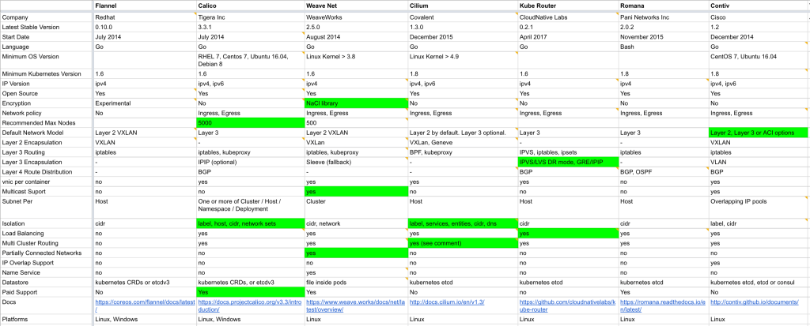

Flannel，Cilium和Contiv均支持二层overlay和三层underlay网络模式，Cilium和Contiv相对小众，Flannel是比较流行和成熟的方案，非常适合小规模集群。Flannel的三层模式host-gw要求主机间二层互通，因此使用较少，更多的是使用其vxlan模式，不过vxlan模式下支持`DirectRouting`选项，开启该选项后可以在通信主机处于同一子网下时切换到host-gw模式，非同一子网下默认使用vxlan模式，从而提高网络性能。

Waeve Net是纯二层overlay网络模式，受限于overlay的性能和节点规模，除非有流量加密需求，否则没有太多理由选择它。

Calico，Kube Router和Romana是纯三层underlay网络模式，其中Calico是最成熟的大规模集群解决方案，underlay网络性能损耗小，集群规模的扩大产生的网络性能影响低，能够充分利用数据中心已有的网络环境，而且提供了丰富灵活的网络策略支持，calico的网络排障也相对容易。Calico目前是最流行的生产级Kubernetes集群网络解决方案。

除了以上方案外，还有诸如OVN，Midonet等其他方案，在此不作介绍。

一些商业容器云产品还会内置网络插件，如OpenShift容器云内置了基于OVS（Open vSwitch）的SDN（软件定义网络）作为统一的集群网络，对于此种情况就没必要再去选择其他的网络插件解决方案了。

而对于定制云，如果集群规模较小，可以使用成熟易管理的Flannel方案，如果是大规模生产集群，则推荐Calico方案。另外，Flannel和Calico还联合发布了统一的网络插件Canal，该方案使用Flannel实现跨节点Pod通信的同时，而Pod和宿主节点的通信则由Calico接管以实现网络策略支持。目前Canal项目已经停止开发，Flannel和Calico都分别开发，但保持了良好的文档以将它们结合在一起。

#### N.2.3.3 入口方案选型

网络入口的目标是让集群外部发起的请求最终被发送的部署再集群种的相应目的应用，也就是Pod上。

##### N.2.3.3.1 入口方案类型

Kubernetes支持的网络入口方案主要有三种类型：

- NodePort：

  NodePort是集群原生支持的网络入口方案，它在集群中的主机节点上为Service提供一个代理端口，利用主机节点的iptables路由转发规则，将到主机节点该端口的流量路由到对应的Service上，然后由Service通过iptables规则将流量再路由到对应的后端Pod上，从而实现从主机网络到后端Pod的访问。

  NodePort方案简单方便，无需额外工具支持，适合临时测试使用，但此方案存在诸多限制：

  - 需要暴露节点IP：节点是Kubernetes的资源，是允许动态添加和删除的，节点IP是可以动态分配的，因此通过节点IP访问集群是难以保证服务可靠性的
  - 需要占用节点端口：NodePort类型的Service会永久占据一个固定的节点端口（除非Service被删除），一方面存在与其他服务产生端口冲突的风险，另一方面节点端口有限，限制集群应用数量
  - 容错负载能力不足：节点故障将导致服务不可用，且通过主机节点作为网络入口增加节点负载压力，容易产生性能瓶颈。当然这些可以通过结合独立的负载均衡器解决
  - 功能单一：依赖iptables的流量转发，不能提供更加丰富网络管理功能

  实际环境种通常不会选择NodePort方案。

- LoadBalancer：

  LoadBalancer方案可以对NodePort方案进行补充，在集群外部署负载均衡器将网络请求负载到主机节点上，也可以直接在Service种配置laodbalancer类型，将外部请求直接通过负载均衡器负载到相应的Pod上。

  LoadBalancer方案也比较简单方便，能够避免节点IP暴露，性能更好，对于云环境，云服务提供商通常会为loadbalancer类型的Service自动创建外部负载均衡，但此方案也有一些缺点：

  - 私有环境下需要外部负载均衡器支持
  - 与NodePort结合的方式依然占用节点端口且需要维护负载节点的更新
  - LoadBalancer提供的是四层负载，负载模式支持有限，且每个服务都需要创建外部负载均衡器，开销大且影响架构灵活性

  LoadBalancer方案局限性大，实际私有环境中也不推荐使用。

- Ingress：

  Ingress是Kubernetes提供的一种资源，Ingress方案支持七层负载，完成了网络出口层与Service层的解耦，配合第三方的Ingress控制器和负载均衡器能够实现灵活强大的负载控制，Ingress控制器监控Ingress资源，将Ingress资源声明的规则刷入负载均衡器中。外部请求进入负载均衡器后，负载均衡器根据配置规则将请求转发到相应的Service，再由Service转发到相应的Pod。

  Ingress是Kubernetes推荐的网络入口方案。但其存在众多的实现方案，需要根据实际需求选择合适的方案。

##### N.2.3.3.2 Ingress方案选型

基于Kubernetes Ingress的入口方案都能够解析标准的Ingress资源，它们之间的区别在于Ingress控制器和后端的负载均衡器，Ingress方案通常将Ingress控制器和负载均衡器合二为一，习惯性统称为Ingress控制器，Ingress控制器以Pod的方式提供服务。部分Ingress方案还会提供增强的API网关支持。

多种Ingress控制器在集群中是可以并存使用的，甚至可以配合使用，为Ingress控制器提供Ingress服务以实现Ingress控制器的负载均衡。但根据Kubernetes集群的用途以及具体应用的场景需求，依然需要为整个集群或特定应用选择合适的Ingress控制器。

主流的Ingress控制器都满足开源，动态服务发现，SSL终止，WebSocket支持等特性，除此之外，我们将主要从以下几个方面对各种Ingress控制器进行对比：

- 协议支持：控制器后端负载均衡器是否支持常用网络通信协议包括HTTP，HTTPS，gRPC，TCP，UDP等
- 后端负载：控制器后端使用的负载均衡器是各不相同的，对其有所了解总是更好的
- 流量路由：将流量路由到特定服务的匹配规则以及是否支持正则匹配
- 命名空间限制：控制器是否支持跨命名空间的流量管理
- 容错与韧性：控制器是否支持对服务实例进行状态检查，是否提供重试和断路器
- 负载均衡算法：控制器支持哪些负载均衡算法
- 认证方式：控制器支持哪些认证方式
- 流量分配：控制器是否支持常用的流量分配机制，如金丝雀部署，A/B测试，镜像等
- 付费订阅：控制器是否带有扩展功能或技术支持的付费版本
- 图形界面：控制器是否搭配图形界面
- GWT验证：控制器是否有内置的JSON Web令牌验证
- 链路跟踪：控制器是否支持通过OpenTracing或其他方式进行链路请求的监视跟踪和调试
- WAF支持：控制器是否支持Web应用程序防火墙
- DDOS保护：控制器是否能够识别异常请求或基于地址，白名单等提供DDOS保护机制
- Lua支持：控制器是否支持Lua扩展

主流的Ingress方案功能特性对比如下：

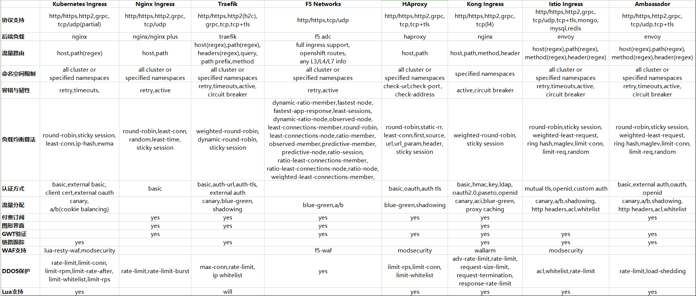

上表中Kubernetes Ingress是Kubernetes社区官方的Nginx Ingress Controller，它成熟易用，并提供了足以满足大多数场景的出色功能，是最简单直接的选择；表中Nginx Ingress是Nginx官方的Nginx Ingress Controller，其性能更高服务更可靠，但限制较大，缺乏流量分配功能，商业版需要付费；Traefik支持丰富的功能，提供了许多微服务方面的支持，支持动态配置，但控制器的高可用需要单独的key-value数据库；F5 BIGIP是稳定可靠的商业解决方案，更能支持全面，但其使用的负载均衡器是昂贵的F5负载均衡硬件，且运维成本高，也不支持链路追踪；HAproxy支持丰富的负载均衡算法，支持动态配置，性能稳定；Kong Ingress拥有丰富的插件集，支持动态配置；基于Envoy的解决方案用于最丰富的功能集，Ambassador被称为Kubernetes原生API微服务网关，Istio Ingress目前已被IstioGateway取代。

目前社区最热门的解决方案是Kubernetes Ingress，Istio和Traefik。Kubernetes Ingress提供出色而够用的功能，Istio是服务网格最热门的项目，Traefik在基础Kubernetes Ingress功能之外，提供了强大的API Gateway功能。

##### N.2.3.3.3 Istio Gateway

Istio是广受欢迎的开源服务网格实现，能够为应用提供动态流量管理，网络策略控制，网络安全认证，链路追踪治理等众多网络增强功能，很好的补齐了Kubernetes在微服务治理上的不足。

Istio中包含一个可选的Gateway组件，用于代替Istio Ingress作为新的网络入口解决方案，不同于Kubernetes Ingress，Istio Gateway是一个独立于平台的抽象，配合VirtualService支持4-7层负载，跳过了Kubernetes的Ingress和Service，能够直接将外部访问流量转发到目标Pod。Istio Gateway在集群中以Pod的方式运行，与其他应用Pod一样接受Istio控制平面的统一管理。

Istio Gateway几乎能够实现基于Kubernetes Ingress的入口方案的所有功能，同时支持大量Istio带来的增强功能：

- HTTP、gRPC、WebSocket、TCP流量的自动负载均衡
- 细粒度的流量路由控制，包含丰富的路由控制、重试、故障转移和故障注入
- 可插拔的访问控制策略层，支持ACL、请求速率限制，请求配额和流量计费
- 集群内度量指标，日志和调用链的自动收集，管理集群的入口、出口流量
- 使用基于身份的认证和授权方式来管理服务间通信的安全
- 结合API Gateway以支持更多特定应用的API网关控制功能

但相比基于Kubernetes Ingress的入口方案，Istio Gateway需要依赖整个Istio系统，丰富的网络控制需要复杂的配置管理，且需要在Pod中注入Sidecar，这会增加些微的请求延迟，带来网络性能损耗（几乎可忽略不计）。

Istio更多是倾向于为微服务提供治理支持，并不是为了取代Kubernetes Ingress，Kubernetes Ingress方案和Istio在集群中是可以并存的，Istio允许只对特定的命名空间或应用生效，可以根据应用的实际情况选择相应的网络出口方案。

### N.2.4 存储优化

Kubernetes内置多种存储插件（In-tree插件），同时允许对接独立存储插件（Out-of-tree插件），提供了非常丰富的存储支持，并且通过**持久卷（PersistentVolume）**子系统对各种存储资源进行抽象，为集群提供了统一的存储API。优化存储有助于确保现有存储资源以高效的方式工作，特定存储配合特定应用也能够为应用提供更好的数据持久化服务，避免不必要的问题。

#### N.2.4.1 存储类型

Kubernetes中可用的存储类型包括以下三类:

| 存储类型         | 描述                                                         | 例子                   |
| ---------------- | ------------------------------------------------------------ | ---------------------- |
| Block(块存储)    | 在操作系统中作为块设备<br>也称为存储区域网络（SAN）<br>适用于需要完全控制存储并绕过文件系统的低层直接操作文件的应用程序<br>不可共享，每次只有一个客户端可以挂载这种类型的端点 | AWS EBS<br>Ceph RBD    |
| File(文件存储)   | 在操作系统中作为要挂在的文件系统导出<br>也称为网络附加存储（NAS）<br>不同协议实现和厂商并行性，延迟，文件锁定机制等可能差异较大<br>可以有多个客户端共享访问 | RHEL NFS<br>NetApp NFS |
| Object(对象存储) | 通过REST API端点访问<br>应用程序必须在应用或容器中构建其驱动程序<br>适用于非结构化数据存储需求<br>可以有多个客户端共享访问 | AWS S3                 |

Kubernetes通过In-tree存储插件原生支持主流块存储和文件存储的挂载，对象存储要求容器应用通过API访问或者开发Out-of-tree插件（Flexvolume或CSI方式）进行对接。

主流块存储支持持久卷动态置备，但文件存储需要依赖独立的驱动插件实现，如Redhat的NFS Provisioner和NetApp的Trident。

#### N.2.4.2 存储选型

 不同的存储类型均有其适用和推荐的应用场景，容器云平台应同时对接这三种类型的存储系统，以便容器化应用能够进行最佳的存储选择。

以下是三种存储在不同应用场景下的适配情况：

| 存储类型 | 多只读 | 多读写 | 镜像仓 | 扩展镜像仓 | 指标   | 日志   | 应用   |
| -------- | ------ | ------ | ------ | ---------- | ------ | ------ | ------ |
| Block    | 支持   | 不支持 | 可用   | 不可用     | 推荐   | 推荐   | 推荐   |
| File     | 支持   | 支持   | 可用   | 可用       | 可用   | 可用   | 推荐   |
| Object   | 支持   | 支持   | 推荐   | 推荐       | 不可用 | 不可用 | 不可用 |

由于存储系统本身都会实现数据的高可用架构，因此除非现实需要，应用端通常无需考虑存储数据的多副本问题。

1. 镜像仓：代表非结构化数据存储的应用场景：
   - 首选存储技术是对象存储，其次块存储。存储技术不需要支持RWX（多读写）访问模式
   - 存储技术必需保证读写一致性，不推荐使用任何NAS存储
   - hostPath本地卷的形式不推荐用于生产环境
2. 扩展镜像仓：提供多副本支持，要求存储数据共享：
   - 首选存储技术是对象存储。存储技术必需支持RWX（多读写）访问模式，且必需保证读写一致性
   - 数据共享需求不能使用块存储（除非通过NAS中转）
   - 大量非结构化数据的存储不推荐NAS存储
3. 指标：代表无需共享的结构化数据存储的应用场景：
   - 首选存储技术是块存储。不推荐使用RWX（多读写）访问模式
   - NAS文件存储在实际测试中可能造成大量无法恢复的数据破坏问题，不建议使用
   - 结构化数据不应使用对象存储，指标引擎（Prometheus等）也不会对接对象存储API
4. 日志：代表日志类统计分析需求高的大数据存储的应用场景：
   - 首选存储技术是块存储
   - 日志类型数据不建议使用NAS存储
5. 应用：不同应用的存储选型依应用的业务需求，技术选型，资源复用等因素的不同而不同，如：
   - Kubernetes集群etcd数据库为了更高的可靠性，应首选使用具有最低一致性延迟的存储技术
   - RDBMS，NoSQL DB等数据库应用倾向于使用专用的块存储来获得最好的性能

#### N.2.3.4 存储编排

Rook是为Kubernetes提供的的开源云原生存储编排系统，它提供了平台，框架和对各种存储解决方案的支持，以与云原生环境进行本地集成。Rook目前提供Ceph，Minion，NFS，EdegeFS，CockroachDB和YugabyteDB等多种存储系统支持，涵盖了全部三种存储类型。

Rook把分布式存储软件转化为自我管理、自我调节和自我修复的存储服务。它通过自动执行存储管理员的任务来实现这一目标，执行的任务包括部署、引导、配置、供应、调节、升级、迁移、灾难恢复、监测和资源管理。此外，Rook还能充分利用底层云原生容器管理、调度和编排平台的强大功能来履行其职责

Rook专为Kubernetes及其它不断演进的云原生环境而设计，它充分利用扩展点，为调度、生命周期管理、资源管理、安全、监测，以及用户体验提供了无缝体验。其优点包括：

- 在商用硬件上运行软件定义存储

- 文件、块和对象存储呈现

- 超大规模和超融合存储选项

- 可以轻松纵向扩展的弹性存储

- 零接触管理

- 带有快照、克隆和版本管理的集成数据保护

## N.3 业务稳定性保障

平台是为业务服务的，保证容器云平台集群的稳定性固然重要，运行在平台上的大量具体业务应用的稳定性保障更是重中之重。对于非容器化应用，保障业务应用的健壮可靠和持续可用通常需要借助单独的集群和负载工具甚至庞大的第三方监控平台,自动化平台等外围系统，应用和基础设施环境的异构性通常导致整个应用稳定性保障体系变得复杂而混乱，维护开销巨大。

容器和容器镜像技术将应用打包成通用镜像并以容器化方式运行，打破了应用和系统环境的异构壁垒，使得应用的打包部署变得简单便捷通用。以Kubernetes为代表的容器云平台充分利用容器化的优势，进一步对应用屏蔽服务器，网络和存储等基础环境的异构性，并集成多种应用服务保障机制，为业务应用的稳定性保驾护航。

在Kubernetes中，业务应用是以容器的方式运行，并以Pod(一组密切相关的容器)作为基本调度单位的。为了保证Pod正常的运行和对外服务，Kubernetes集成了**负载均衡**，**健康检查**，**服务质量**，**弹性伸缩**，**变更策略**等平台级服务保障机制，Kubernetes平台上的应用不再需要依赖额外的工具或系统保障业务的稳定性，当然传统的稳定性保障方案依然适用于Kubernetes容器云环境，但建议考虑其必要性。

### N.3.1 负载均衡

负载均衡既能分摊应用节点的服务压力，又能保障应用的不间断服务，是最典型的应用稳定性保障手段。Kubernetes在设计之初就充分考虑了针对容器的服务发现与负载均衡机制，提供了Service资源，并通过kube-proxy配合cloud provider来适应不同的应用场景。Kubernetes的后续更新中又在此基础上产生了一些新的负载均衡机制。

目前kubernetes中主要的负载均衡机制及其应用场景如下：

| 负载均衡              | 应用场景                                                     |
| --------------------- | ------------------------------------------------------------ |
| Service               | 使用Service提供cluster内部的负载均衡，借助cloud provider提供的LB提供外部访问 |
| Ingress Controller    | 使用Service提供cluster内部的负载均衡，通过自定义LB提供外部访问 |
| Service Load Balancer | load balancer直接运行在容器中，实现Bare Metal的Service Load Balancer |
| Custom Load Balancer  | 自定义负载均衡，并替代kube-proxy，一般在物理部署Kubernetes时使用，方便接入已有的外部服务 |

#### N.3.1.1 Service

Service是对一组提供相同功能的Pod的抽象，并为它们提供一个统一的虚IP入口。借助Service，应用可以方便的实现服务发现与负载均衡，并实现应用的零宕机升级。Service通过标签来选取服务后端，一般配合Replication Controller或者Deployment来保证后端容器的正常运行。

在 Kubernetes 中创建一个新的 Service 对象需要两大模块同时协作，其一是控制器，它需要在每次客户端创建新的 Service 对象时，生成用于暴露一组 Pod 的 Kubernetes 对象，也就是 Endpoint 对象；其二是 kube-proxy，它运行在 Kubernetes 集群中的每一个节点上，会监听API Server，根据 Service 和 Endpoint 的变动改变节点上 iptables 或者 ipvs 中保存的规则，利用这些规则进行高效的流量转发。

Service利用iptables或ipvs的路由转发规则提供的概率路由机制(--probability)将对Service 虚IP的访问概率性路由到某个真正的后端Pod上，实现应用服务的负载均衡。

Kubernetes的kube-proxy支持三种代理模式: userspace，iptables，ipvs。其中userspace模式在用户态处理流量转发，效率相对较低，iptables和ipvs是Linux内核特性，可以直接在内核态完成转发，效率更高。目前默认的代理模式是iptables，而ipvs相比iptables的遍历式规则匹配，使用了更高效的哈希表匹配，在大量Service导致大量的路由转发规则的情况下性能更优，而且支持更多的负载均衡算法，未来可能成为默认模式。


在 Iptables 模式下，kube-proxy 通过在目标 node 节点上的 Iptables 中的 NAT 表的 PREROUTIN 和 POSTROUTING 链中创建一系列的自定义链 (这些自定义链主要是”KUBE-SERVICE”链， “KUBE-POSTROUTING”链，每个服务对应的”KUBE-SVC-XXXXXX”链和”KUBE-SEP-XXXX”链)，然后通过这些自定义链对流经到该 Node 的数据包做 DNAT 和 SNAT 操作从而实现路由，利用Iptables的概率路由机制(--probability)将对Service 虚IP的访问概率性路由到某个真正的后端Pod上，实现应用服务的负载均衡。

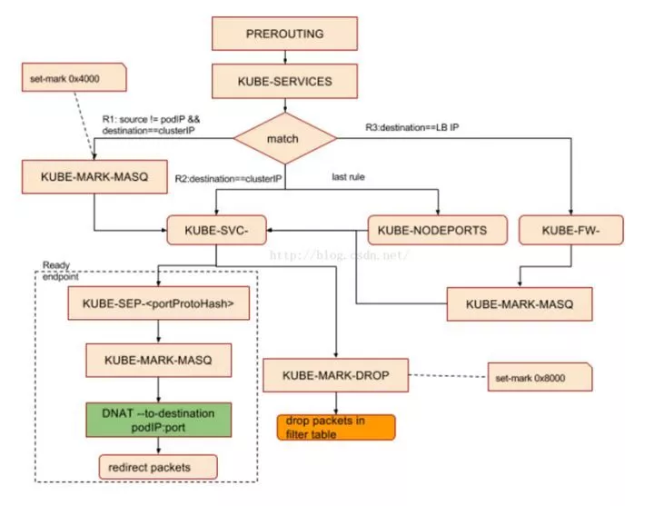

Service主要有以下几种类型：

- ClusterIP：默认类型，自动分配一个仅cluster内部可以访问的虚拟IP
- NodePort：在ClusterIP基础上为Service在每台机器上绑定一个端口，这样就可以通过`:NodePort`来访问该服务
- LoadBalancer：在NodePort的基础上，借助cloud provider创建一个外部的负载均衡器，并将请求转发到`:NodePort`
- Headless Service：不分配ClusterIP，直接通过service域名或者指定的域名(ExternalName)关联到后端Pod或者其他服务上

> service还与kubernetes内置的dns组件coredns配合使用提供了服务发现支持。

#### N.3.1.2 Ingress Controller

Service虽然解决了服务发现和负载均衡的问题，但它在使用上还是有一些限制，比如对外访问的时候，NodePort类型需要在外部搭建额外的负载均衡，而LoadBalancer要求kubernetes必须跑在支持的cloud provider上面。

Ingress就是为了解决这些限制而引入的新资源，主要用来将服务暴露到集群之外，并且可以自定义服务的访问策略。Ingress并不会取代Service，而是作用于Service之上，将外部请求代理或转发到对应的Service上，再由Service向下转发。比如想要通过负载均衡器实现不同子域名到不同服务的访问：

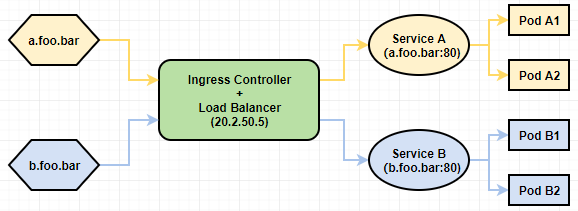

Ingress本身只是一种API资源，需要配合ingress controller使用，ingress controller会通过API Server监听Ingress资源并根据Ingress定义自动更新负载均衡器的规则文件。负载均衡器并非集群组件，可以运行在集群内部或外部，可以是硬件负载也可以是软负载，软负载通常将ingress controller和负载均衡器整合在一个容器中提供服务。目前Kubernetes上主流的ingress controller有**Nginx Ingress Controller**，**Traefik**，**HAProxy Ingress**，**F5 BIGIP**，**Istio Ingress**等。其中Nginx Ingress Controller是推荐方案，可以根据实际需要进行选择。

#### N.3.1.3 Service Load Balancer

在Ingress出现以前，Service Load Balancer是推荐的解决Service局限性的方式。Service Load Balancer将haproxy跑在容器中，并监控service和endpoint的变化，通过容器IP对外提供4层和7层负载均衡服务。

社区提供的Service Load Balancer支持四种负载均衡协议：TCP、HTTP、HTTPS和SSL TERMINATION，并支持ACL访问控制。

#### N.3.1.4 Custom Load Balancer

虽然Kubernetes提供了丰富的负载均衡机制，但在实际使用的时候，还是会碰到一些复杂的场景是它不能支持的，比如：

- 接入已有的负载均衡设备
- 多租户网络情况下，容器网络和主机网络是隔离的，这样`kube-proxy`就不能正常工作

这个时候就可以自定义组件，并代替kube-proxy来做负载均衡。基本的思路是监控kubernetes中service和endpoints的变化，并根据这些变化来配置负载均衡器。比如weave flux、nginx plus、kube2haproxy等。

### N.3.2 健康检查 

Kubernetes提供了一整套对于Pod的状态机制和生命周期管。对于Pod的健康检查，Kubernetes默认只检查容器是否正常运行。但容器运行不代表容器内的应用仍可对外提供服务，因此Kubernetes通过Probe(探针)机制提供更准确的健康检查。健康检查为应用提供了故障自动恢复能力，从容器和容器内应用两个层面保证了应用的稳定性。

#### N.3.2.1 Pod生命周期

Pod的本质是一组容器，Pod的状态便是容器状态的体现和概括，同时容器的状态变化会影响Pod的状态变化，触发Pod的生命周期阶段转换。Pod 的运行阶段（phase）是 Pod 在其生命周期中的简单宏观概述。该阶段并不是对容器或 Pod 的综合汇总，也不是为了做为综合状态机。Pod的生命周期分为以下几个阶段:

- 挂起（Pending）：Pod 已被 Kubernetes 系统接受，但有一个或者多个容器镜像尚未创建。等待时间包括调度 Pod 的时间和通过网络下载镜像的时间，这可能需要花点时间
- 运行中（Running）：该 Pod 已经绑定到了一个节点上，Pod 中所有的容器都已被创建。至少有一个容器正在运行，或者正处于启动或重启状态
- 成功（Succeeded）：Pod 中的所有容器都被成功终止，并且不会再重启
- 失败（Failed）：Pod 中的所有容器都已终止了，并且至少有一个容器是因为失败终止。也就是说，容器以非0状态退出或者被系统终止
- 未知（Unknown）：因为某些原因无法取得 Pod 的状态，通常是因为与 Pod 所在主机通信失败

Pod 有一个`PodStatus`对象，其中包含一个PodCondition数组。 `PodCondition`包含以下以下字段：

- lastProbeTime：Pod condition最后一次被探测到的时间戳
- lastTransitionTime：Pod最后一次状态转变的时间戳
- message：状态转化的信息，一般为报错信息，例如：containers with unready status: [c-1]
- reason：最后一次状态形成的原因，一般为报错原因，例如：ContainersNotReady
- status：包含的值有 True、False 和 Unknown
- type：Pod状态的几种类型

其中type字段包含以下几个值：

- PodScheduled：Pod已经被调度到运行节点
- Ready：Pod已经可以接收请求提供服务
- Initialized：所有的init container已经成功启动
- Unschedulable：无法调度该Pod，例如节点资源不够
- ContainersReady：Pod中的所有容器已准备就绪

#### N.3.3.2 重启策略

当Pod中的容器出现正常或异常退出时，Kubernetes会根据Pod指定的重启策略(restartPolicy)决定处理动作和Pod状态转换，重启策略有以下三种：

- Always: 总是尝试重启容器。让Pod保持正常Running状态。无论Pod中几个容器出现正常或异常退出
- OnFailure: 只有Pod中的任意容器出现异常退出时才尝试重启容器，让Pod保持正常Running状态.当Pod中所有容器均正常退出时，Pod进入Succeeded状态
- Never: 永不尝试重启容器，只要Pod还存在一个运行状态的容器，Pod就保持在Running状态，否则Pod根据容器是正常或异常退出而相应进入Succeeded或Failed状态

> 可以管理Pod的控制器有Replication Controller，Job，DaemonSet，及kubelet（静态Pod）。
>
> 1. RC和DaemonSet：必须设置为Always，需要保证该容器持续运行。
> 2. Job：OnFailure或Never，确保容器执行完后不再重启。
> 3. kubelet：在Pod失效的时候重启它，不论RestartPolicy设置为什么值，并且不会对Pod进行健康检查。

#### N.3.2.3 Probe机制

容器的健康状态和容器内应用的健康状态并不总是一致的，容器正常运行时，容器内的应用可能由于阻塞，内部错误等原因无法正常处理请求，或者由于应用尚未初始化完成而无法正常接受请求。异常为了提供更精确的健康检查，Kubernetes提供了**Probe(探针)**机制。

Probe分为两种:

- Liveness Probe: 存活探针，指示容器是否正在运行。如果存活探测失败，则 kubelet 会杀死容器，并且容器将受到其重启策略的影响。如果容器不提供存活探针，则默认状态为 `Success`
- readinessProbe：就绪探针，指示容器是否准备好服务请求。如果就绪探测失败，端点控制器将从与 Pod 匹配的所有 Service 的端点中删除该 Pod 的 IP 地址。初始延迟之前的就绪状态默认为 `Failure`。如果容器不提供就绪探针，则默认状态为 `Success`

Probe支持以下三种检查方法:

- ExecAction: 在容器中执行指定的命令进行检查，当命令执行成功（返回码为0），检查成功
- TCPSocketAction：对于容器中的指定TCP端口进行检查，当TCP端口被占用，检查成功
- HTTPGetAction: 发生一个HTTP请求，当返回码介于200~400之间时，检查成功

Probe只是检查容器或应用的健康状态，Pod是否会重启由重启策略根据检查结果进行控制。

如果容器中的进程能够在遇到问题或不健康的情况下自行崩溃，则不一定需要存活探针; kubelet 将根据 Pod 的`restartPolicy` 自动执行正确的操作。

如果希望容器在探测失败时被杀死并重新启动，那么需要指定存活探针，并指定`restartPolicy` 为 Always 或 OnFailure。

如果要仅在探测成功时才开始向 Pod 发送流量，那么需要指定就绪探针。在这种情况下，就绪探针可能与存活探针相同，但是 spec 中的就绪探针的存在意味着 Pod 将在没有接收到任何流量的情况下启动，并且只有在探针探测成功后才开始接收流量。

如果希望容器能够自行维护，可以指定一个就绪探针，该探针检查与存活探针不同的端点。

### N.3.3 服务质量

为了实现资源被有效调度和分配的同时提高资源利用率，Kubernetes针对不同服务质量的预期，通过 QoS（Quality of Service）来对 pod 进行服务质量管理。对于一个pod来说，服务质量体现在两个具体的指标：`CPU和内存`。当节点上内存资源紧张时，kubernetes会根据预先设置的不同QoS类别进行相应处理。

#### N.3.3.1 服务质量级别

QoS主要分为Guaranteed、Burstable和Best-Effort三级，优先级从高到低。可以通过`kubectl describe`命令或者在Pod的status字段查看其QoS级别。

##### N.3.3.1.1 Guaranteed

属于该级别的pod有以下两种：

- Pod中的所有容器都且仅设置了 CPU 和内存的 limits
- pod中的所有容器都设置了 CPU 和内存的 requests 和 limits ，且单个容器内的`requests==limits`（requests不等于0）

> 若容器指定了requests而未指定limits，则limits的值等于节点resource的最大值；若容器指定了limits而未指定requests，则requests的值等于limits。因此两种情况本质上是一种。

pod中的所有容器都且仅设置了limits：

```yaml
containers:
  name: foo
    resources:
      limits:
        cpu: 10m
        memory: 1Gi
  name: bar
    resources:
      limits:
        cpu: 100m
        memory: 100Mi
```

pod 中的所有容器都设置了 requests 和 limits，且单个容器内的`requests==limits`：

```yaml
containers:
  name: foo
    resources:
      limits:
        cpu: 10m
        memory: 1Gi
      requests:
        cpu: 10m
        memory: 1Gi

  name: bar
    resources:
      limits:
        cpu: 100m
        memory: 100Mi
      requests:
        cpu: 100m
        memory: 100Mi
```

容器foo和bar内resources的requests和limits均相等，该pod的QoS级别属于`Guaranteed`。

##### N.3.3.1.2 Burstable

pod中只要有一个容器的requests和limits的设置不相同，该pod的QoS即为`Burstable`。

容器foo指定了resource，而容器bar未指定：

```yaml
containers:
  name: foo
    resources:
      limits:
        cpu: 10m
        memory: 1Gi
      requests:
        cpu: 10m
        memory: 1Gi

  name: bar
```

容器foo设置了内存limits，而容器bar设置了CPU limits：

```yaml
containers:
  name: foo
    resources:
      limits:
        memory: 1Gi

  name: bar
    resources:
      limits:
        cpu: 100m
```

##### N.3.3.1.3 Best-Effort

如果Pod中所有容器的resources均未设置requests与limits，该pod的QoS即为`Best-Effort`。

容器foo和容器bar均未设置requests和limits：

```yaml
containers:
  name: foo
    resources:
  name: bar
    resources:
```

#### N.3.3.2 内存资源回收策略

Kubernetes 通过`cgroup`给Pod设置QoS级别，由于CPU是可抢占式资源，而内存是不可抢占的，也就是说CPU资源不足不会导致Pod被杀死，而内存资源不足会。当内存资源不足时先杀死优先级低的Pod。

##### N.3.3.2.1 OOM评分

容器本质上是宿主机上的进程，在实际使用过程中，通过`OOM`分数值(score)来区分Pod优先级，`OOM`分数值范围为0-1000。`OOM`分数值根据`OOM_ADJ`参数计算得出。

对于`Guaranteed`级别的Pod，`OOM_ADJ`参数设置成了**-998**，对于`Best-Effort`级别的Pod，`OOM_ADJ`参数设置成了**1000**，对于`Burstable`级别的Pod，`OOM_ADJ`参数取值**从2到999**。

对于Kuberntes保留资源，比如kubelet，docker，`OOM_ADJ`参数设置成了**-999**，表示不会被`OOM`杀死。`OOM_ADJ`参数设置的越大，计算出来的`OOM`分数越高，表明该Pod优先级就越低，当出现资源竞争时会越早被杀死，对于`OOM_ADJ`参数是-999的表示Kubernetes永远不会因为`OOM`将其杀死。

##### N.3.3.2.2 资源回收顺序

内存资源不足时三类Pod资源的回收顺序:

- Best-Effort pods：系统用完了全部内存时，该类型pods会最先被杀死
- Burstable pods：系统用完了全部内存，且没有 Best-Effort 类型的容器可以被杀死时，该类型的pods会被杀死
- Guaranteed pods：系统用完了全部内存，且没有 Burstable 与 Best-Effort 类型的容器可以被杀死时，该类型的pods会被杀死

#### N.3.3.3 CPU资源管理策略

默认情况下，kubelet 使用**CFS 配额**(Linux内核CPU调度)来执行Pod的CPU约束。当节点上运行了很多CPU密集的Pod时，工作负载可能会迁移到不同的CPU核心，这取决于调度时Pod是否被扼制，以及哪些CPU核心是可用的。许多工作负载对这种迁移不敏感，因此无需任何干预即可正常工作。

然而，有些工作负载的性能明显地受到CPU缓存亲和性以及调度延迟的影响，对此，kubelet提供了可选的CPU管理策略，来确定节点上的一些分配偏好。

CPU管理器（CPU Manager作为 alpha 特性引入 Kubernetes 1.8 版本。从 1.10 版本开始，作为beta特性默认开启。

CPU管理策略通过kubelet参数`--cpu-manager-policy`来指定。支持两种策略：

- `none`: 默认策略，表示现有的调度行为
- `static`: 允许为节点上具有某些资源特征的Pod 赋予增强的CPU亲和性和独占性

CPU管理器定期通过CRI写入资源更新，以保证内存中CPU分配与cgroupfs一致。同步频率通过新增的kubelet配置参数`--cpu-manager-reconcile-period`来设置。 如果不指定，默认与`--node-status-update-frequency`的周期相同。

##### N.3.3.3.1 None策略

None策略显式地启用现有的默认CPU亲和方案，不提供操作系统调度器默认行为之外的亲和性策略。 通过**CFS配额**来实现Guaranteed pods的CPU使用限制。

##### N.3.3.3.2 Static策略

Static策略针对具有整数型CPU `requests`的`Guaranteed` Pod ，它允许该类Pod中的容器访问节点上的独占CPU资源。这种独占性是使用**cpuset cgroup控制器**来实现的。

该策略管理一个共享CPU资源池，最初，该资源池包含节点上所有的CPU资源。可用的独占性 CPU 资源数量等于节点的CPU总量减去通过`--kube-reserved`或`--system-reserved`参数保留的CPU。

从1.17版本开始，CPU保留列表可以通过 kublet 的 `–reserved-cpus`参数显式地设置。 通过 `–reserved-cpus`指定的显式CPU列表优先于使用 `–kube-reserved`和`–system-reserved`参数指定的保留CPU。 通过这些参数预留的CPU是以整数方式，按物理内核ID升序从初始共享池获取的。 

共享池是`BestEffort`和`Burstable` pod 运行的CPU集合。`Guaranteed` pod中的容器，如果声明了非整数值的CPU `requests`，也将运行在共享池的CPU上。只有`Guaranteed` pod 中，指定了整数型CPU `requests`的容器，才会被分配独占 CPU 资源。

当`Guaranteed` pod调度到节点上时，如果其容器符合静态分配要求，相应的CPU会被从共享池中移除，并放置到容器的cpuset中，这种静态分配增强了CPU亲和性，减少了CPU密集的工作负载在节流时引起的上下文切换。

>诸如容器运行时和kubelet本身的系统服务可以继续在这些独占CPU上运行。独占性仅针对其他Pod。
>
>CPU管理器不支持运行时下线和上线CPUs。此外，如果节点上的在线CPUs集合发生变化，则必须驱逐节点上的pods，并通过删除kubelet根目录中的状态文件`cpu_manager_state`来手动重置CPU管理器。
>
>当启用static策略时，要求使用`--kube-reserved` 和/或 `--system-reserved` 或 `--reserved-cpus`来保证预留的CPU值大于零。 这是因为零预留CPU值可能使得共享池变空。

由此可见，Kubernetes在提供应用稳定性保障的同时如果资源充足，也考虑到生产实际情况提供了灵活的资源配额和优先级策略。如果资源充足，可将Pod的QoS类型均设置为`Guaranteed`。用计算资源换业务性能和稳定性，减少排查问题时间和成本。如果想更好的提高资源利用率，业务服务可以设置为`Guaranteed`，而其他服务根据重要程度可分别设置为`Burstable`或`Best-Effort`。

### N.3.3 弹性伸缩

在实际的应用部署过程中，应用的容量规划和实际负载之间往往是存在落差的，对于业务应用的请求数量在不同时段或不同时期往往存在明显的波峰波谷现象。一方面实际负载难以预料，另一方面如果只按照波峰请求规划容量则难免存在资源浪费，而低于波峰请求的容量规划又可能导致应用节点资源利用率过高，影响应用服务的稳定性。

通常解决方案是根据实际负载进行应用容量的扩缩容。在Kubernetes平台中就为Pod提供了水平自动伸缩（Horizontal Pod Autoscaling，HPA）的特性。HPA可以根据Pod的CPU利用率（或其他应程序提供的度量指标custom metrics）自动伸缩一个Replication Controller、Deployment 或者Replica Set中的Pod数量（或者基于一些应用程序提供的度量指标，目前这一功能处于alpha版本），保证应用的稳定性。这一特性无法适用与DaemonSets这一无法缩放的对象。

此外Kubernetes还实验性的提供了垂直自动伸缩（Vertical Pod Autoscaler，VPA）特性，它允许根据Pod使用的资源指标自动调整Pod的CPU和内存的requests值。这一特性目前尚不成熟，自动伸缩过程中会导致Pod重启，且不能和HPA一起工作，实际环境中建议使用HPA。

本节弹性伸缩主题将只讨论HPA。

#### N.3.3.1 工作机制

Pod水平自动伸缩特性由Kubernetes API资源和控制器实现。资源决定了控制器的行为。 控制器会周期性的获取平均CPU利用率，并与目标值相比较后来调整replication controller或deployment中的副本数量。

Pod水平自动伸缩的实现是一个控制循环，由controller manager的`--horizontal-pod-autoscaler-sync-period`参数指定周期（默认值为15秒）。

每个周期内，controller manager根据每个HorizontalPodAutoscaler定义中指定的指标查询资源利用率。 

通常情况下，控制器将从一系列的聚合API（`metrics.k8s.io`、`custom.metrics.k8s.io`和`external.metrics.k8s.io`） 中获取指标数据。 `metrics.k8s.io` API 通常由metrics-server（需要额外启动）提供。

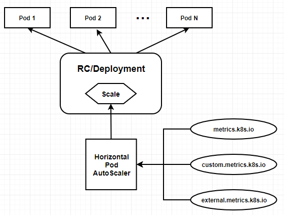

> 目前在 Kubernetes 中，可以针对replication controllers或deployment执行滚动升级（rolling update），它们会管理底层副本数。 Pod 水平缩放只支持deloyment，也就是说不能将Horizontal Pod Autoscaler绑定到某个replication controller再执行滚动升级（例如使用 `kubectl rolling-update` 命令），因为Horizontal Pod Autoscaler无法绑定到滚动升级时创建的新副本。

#### N.3.3.2 伸缩算法

从最基本的角度来看，Pod水平自动缩放控制器跟据当前指标和期望指标来计算缩放比例。

```
期望副本数 = ceil[当前副本数 * ( 当前指标 / 期望指标 )]
```

例如，当前指标为`200m`，目标设定值为`100m`,那么由于`200.0 / 100.0 == 2.0`， 副本数量将会翻倍。 如果当前指标为`50m`，副本数量将会减半，因为`50.0 / 100.0 == 0.5`。 如果计算出的缩放比例接近1.0（跟据`--horizontal-pod-autoscaler-tolerance` 参数全局配置的容忍值，默认为0.1）， 将会放弃本次缩放。

如果HorizontalPodAutoscaler指定的是`targetAverageValue` 或 `targetAverageUtilization`， 那么将会把指定Pod的平均指标做为`currentMetricValue`。 然而，在检查容忍度和决定最终缩放值前，我们仍然会把那些无法获取指标的pod统计进去。

所有被标记了删除时间戳(Pod正在关闭过程中)的Pod和 失败的Pod都会被忽略。

如果某个Pod缺失指标信息，它将会被搁置，只在最终确定缩值时再考虑。

当使用CPU指标来缩放时，任何还未就绪（例如还在初始化）状态的Pod或最近的指标为就绪状态前的Pod， 也会被搁置。

由于受技术限制，Pod水平缩放控制器无法准确的知道pod什么时候就绪， 也就无法决定是否暂时搁置 Pod。 `--horizontal-pod-autoscaler-initial-readiness-delay` 参数（默认为30s），用于设置Pod准备时间， 在此时间内的Pod统统被认为未就绪。 `--horizontal-pod-autoscaler-cpu-initialization-period`参数（默认为5分钟），用于设置pod的初始化时间， 在此时间内的Pod，CPU资源指标将不会被采纳。

在排除掉被搁置的Pod后，缩放比例就会跟据`currentMetricValue / desiredMetricValue`计算出来。

如果有任何Pod的指标缺失，我们会更保守地重新计算平均值， 在需要缩小时假设这些Pod消耗了目标值的 100%， 在需要放大时假设这些pod消耗了0%目标值。 这可以在一定程度上抑制伸缩的幅度。

此外，如果存在任何尚未就绪的Pod，我们可以在不考虑遗漏指标或尚未就绪的Pods的情况下进行伸缩， 我们保守地假设尚未就绪的Pods消耗了试题指标的0%，从而进一步降低了伸缩的幅度。

在缩放方向（缩小或放大）确定后，我们会把未就绪的Pod和缺少指标的Pod考虑进来再次计算使用率。 如果新的比率与缩放方向相反，或者在容忍范围内，则跳过缩放。 否则，我们使用新的缩放比例。

如果创建HorizontalPodAutoscaler时指定了多个指标， 那么会按照每个指标分别计算缩放副本数，取最大的进行缩放。 如果任何一个指标无法顺利的计算出缩放副本数（比如，通过API获取指标时出错）， 那么本次缩放会被跳过。

最后，在HPA控制器执行缩放操作之前，会记录缩放建议信息（scale recommendation）。 控制器会在操作时间窗口中考虑所有的建议信息，并从中选择得分最高的建议。 这个值可通过kube-controller-manager服务的启动参数 `--horizontal-pod-autoscaler-downscale-stabilization` 进行配置， 默认值为5min。 这个配置可以让系统更为平滑地进行缩容操作，从而消除短时间内指标值快速波动产生的影响。

当使用Horizontal Pod Autoscaler管理一组副本缩放时， 有可能因为指标动态的变化造成副本数量频繁的变化，有时这被称为 **抖动**。`--horizontal-pod-autoscaler-downscale-stabilization`: 这个 `kube-controller-manager` 的参数表示缩容冷却时间。 即自从上次缩容执行结束后，多久可以再次执行缩容，默认时间是5分钟(`5m0s`)。

#### N.3.3.3 度量指标

在Kubernetes 1.6支持了基于多个指标进行缩放。 你可以使用 `autoscaling/v2beta2` API 来为Horizontal Pod Autoscaler指定多个指标。HorizontalPodAutoscaler将会依次考量各个指标。 HorizontalPodAutoscaler将会计算每一个指标所提议的副本数量，然后最终选择一个最高值。

Horizontal Pod Autoscaler支持三种度量指标：

- 资源度量指标（resource metric）: HPA默认使用的度量指标，这一指标默认度量Pod的CPU利用率，另外也可以选择度量内存占用

  ```yaml
  apiVersion: autoscaling/v2alpha1
  kind: HorizontalPodAutoscaler
  metadata:
    name: php-apache
    namespace: default
  spec:
    scaleTargetRef:
      apiVersion: apps/v1beta1
      kind: Deployment
      name: php-apache
    minReplicas: 1
    maxReplicas: 10
    metrics:
    - type: Resource
      resource:
        name: cpu
        targetAverageUtilization: 50
  ```

- Pod度量指标（pod metric）: 一种自定义度量指标，这些指标从某一方面描述了Pod，在不同Pod之间进行平均，并通过与一个目标值比对来确定副本的数量

  ```yaml
  type: Pods
  pods:
    metricName: packets-per-second
    targetAverageValue: 1k
  ```

- 对象度量指标（object metric）: 一种自定义度量指标，这些度量指标用于描述一个在相同名字空间(namespace)中的其他对象。 请注意这些度量指标用于描述这些对象，并非从对象中获取。对象度量指标并不涉及平均计算

  ```yaml
  type: Object
  object:
    metricName: requests-per-second
    target:
      apiVersion: extensions/v1beta1
      kind: Ingress
      name: main-route
    targetValue: 2k
  ```

#### N.3.3.4 弹性伸缩示例

本节将以一个php-apache服务器为例展示HPA弹性伸缩如何使用。

1. 部署和运行php-apache服务器并将其暴露为Kubernetes服务

   ```bash
   kubectl run php-apache --image=gcr.io/google_containers/hpa-example --requests=cpu=200m --expose --port=80
   ```

2. 创建Horizontal Pod Autoscaler

   ```bash
   # 创建一个HPA基于cpu利用率为50%为指标控制Pod的副本数量在1到10之间
   kubectl autoscale deployment php-apache --cpu-percent=50 --min=1 --max=10
   # 查看HPA
   kubectl get hpa
   ```

3. 增加负载

   ```yaml
   # 运行负载容器
   kubectl run -i --tty load-generator --image=busybox /bin/sh
   # 容器内运行负载脚本
   $ while true; do wget -q -O- http://php-apache.default.svc.cluster.local; done
   # 查看HPA
   kubectl get hpa --watch
   # 查看deployment
   kubectl get deployment php-apache
   ```

4. 停止负载

   ```yaml
   # 在负载容器busybox终端中输入<Ctrl> + C终止负载的产生
   # 查看HPA
   kubectl get hpa
   # 查看deployment
   kubectl get deployment php-apache
   ```

### N.3.4 变更策略

应用通常是需要持续维护和更新的，应用在更新维护时根据变更策略的不同会对应用的服务可用性和服务质量产生不同的影响，同时也对应用的运行环境和资源占用提出了不同的要求。

在对应用服务稳定性，资源环境约束和业务场景需求等多方因素进行权衡后，选择合适的的变更策略是非常重要的。Kubernetes中提供了几种不同的应用变更策略以应对不同的需求：

- recreate：重建，停止旧版本后部署新版本
- rolling-update：滚动更新，以顺序更新的方式发布新版本
- blue/green：蓝绿发布，新版本与旧版本共存并进行流量切换
- canary：金丝雀发布，将新版本先面向部分用户发布，然后逐步完成全量发布
- a/b testing：A/B测试，以精确的方式（HTTP头部，cookie，权重等）向部分用户发布新版本。A/B测是一种基于数据统计做出业务决策的技术，并不是Kubernetes支持的原生策略，需要依赖诸如Istio，Linkerd，Traefik等高级组件实现。

#### N.3.4.1 重建

重建（recreate）策略会终止应用所有正在运行的实例，然后用新的版本重新创建和运行应用。


```yaml
spec:
  replicas: 3
  strategy:
    type: Recreate
```

重建策略是一个虚拟部署，它意味着服务的停机时间取决于应用程序的关闭和启动持续时间。

#### N.3.4.2 滚动更新

滚动更新（rolling-update）策略通过逐个替换实例来逐步部署新版本的应用，直到所有实例都被替换完成为止。它通常遵循以下过程：在负载均衡器后面使用版本 A 的实例池，然后部署版本 B 的一个实例，当服务准备好接收流量时(Readiness Probe 正常)，将该实例添加到实例池中，然后从实例池中删除一个版本 A 的实例并关闭，如此循环直到全部更新完成。

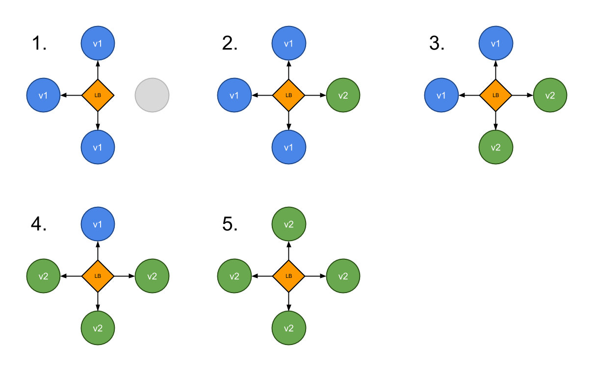

```yaml
spec:
  replicas: 3
  strategy:
    type: RollingUpdate
    rollingUpdate:
      maxSurge: 2        # 一次可以添加多少个Pod
      maxUnavailable: 1  # 滚动更新期间最大多少个Pod不可用
```

滚动更新过程中新版本出现问题可以通过`kubectl rollout`进行回滚。但该策略新旧版本的实例替换相对较慢，无法控制访问流量。

#### N.3.4.3 蓝绿发布

蓝绿发布（blue/green）策略与滚动更新不同，新旧版本一起发布和运行，在测试新版本满足要求后，然后Kubernetes中扮演负载均衡器角色的 Service 对象，通过替换 label selector 中的版本标签来将流量发送到新版本，也可以通过Ingress控制器完成流量控制。

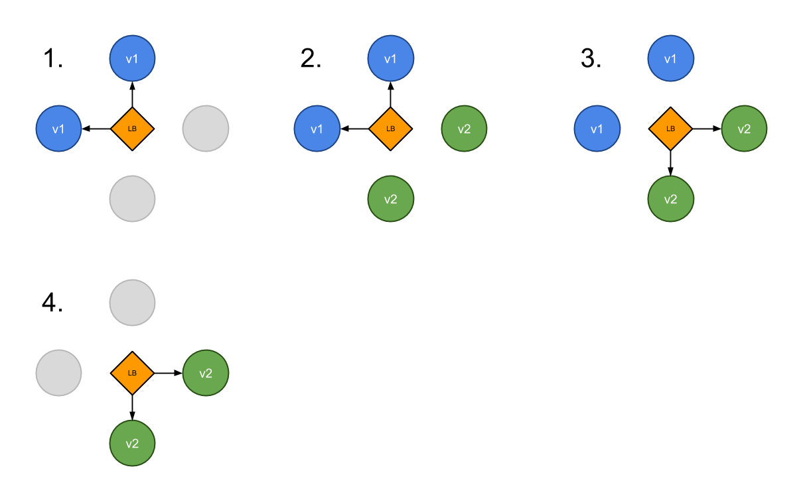

```yaml
selector:
  app: my-app
  version: v1.0.0
```

蓝绿发布策略能够实现实时部署和回滚，不存在新旧版本同时可用的问题。但这种方式短时间内需要两倍的资源占用，新版本应事先通过良好的测试以保证上线后尽量不影响用户体验。

#### N.3.4.4 金丝雀发布

金丝雀发布（canary）策略让部分用户访问到新版本应用，在Kubernetes中，可以使用两个具有相同Pod标签的Deployment来实现金丝雀部署。新版本的副本和旧版本的一起发布。在一段时间后如果没有检测到错误，则可以扩展新版本的副本数量并删除旧版本的应用。

Kubernetes默认通过为新旧版本的副本设置不同的数量实现按照百分比控制流量导向。如需更精确的控制策略，则建议使用A/B测试策略。


```yaml
spec:
  replicas: 9
---
spec:
  replicas: 1
```

金丝雀发布策略与滚动更新策略一样是新旧版本共存的，这种方式能够快速回滚，方便错误和性能监控，能够对流量作出更精准的控制。但发布较慢，高精度的流量控制意味着更多的资源浪费，控制策略也过于单一。

#### N.3.4.5 A/B测试

A/B测试（a/b testing）策略实际上是一种基于统计信息而非部署策略来制定业务决策的技术，与业务结合非常紧密。但是它们也是相关的，也可以使用金丝雀发布来实现。

除了基于权重在版本之间进行流量控制之外，A/B测试还可以基于一些其他参数（比如Cookie、User Agent、地区等等）来精确定位给定的用户群，该技术广泛用于测试一些功能特性的效果，然后按照效果来进行确定。要使用这些细粒度的控制，建议使用Istio，可以根据权重或HTTP头等来动态请求路由控制流量转发。

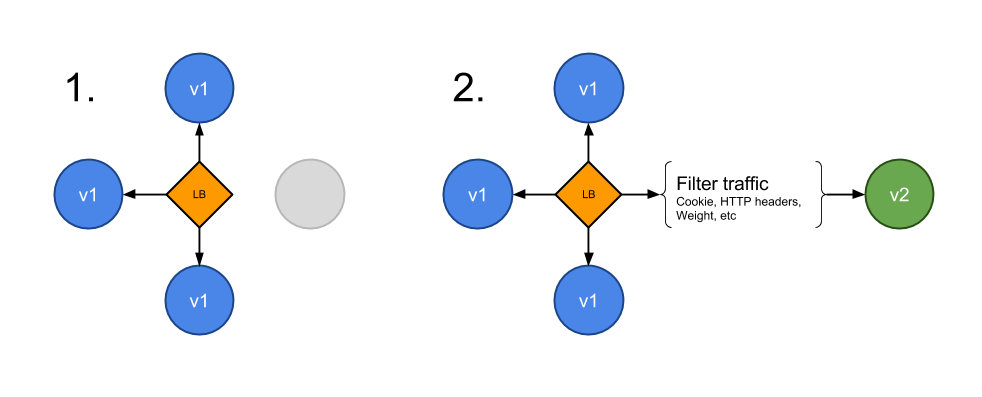

```yaml
route:
- tags:
  version: v1.0.0
  weight: 90
- tags:
  version: v2.0.0
  weight: 10
```

A/B测试测允许多版本并行运行，支持多样化的流量控制策略，能够完全控制流量的分配。但特定的访问错误难以排查，需要分布式链路跟踪，此外它不是Kubernetes原生支持的。

发布应用有许多种方法，当发布到开发/测试环境的时候，**重建**或者**滚动更新**通常是一个不错的选择。在生产环境，**滚动更新**或者**蓝绿发布**比较合适，但是新版本的提前测试是非常有必要的。如果你对新版本的应用不是很有信心的话，那应该使用**金丝雀**发布，将用户的影响降到最低。最后，如果你的公司需要在特定的用户群体中进行新功能的测试，例如，移动端用户请求路由到版本A，桌面端用户请求路由到版本B，那么你就应该使用**A/B测试**，借助Istio等服务网格（service mesh）系统，可以根据某些请求参数来确定用户应路由的服务。

Kubernetes提供了丰富的机制保证了业务应用在各个生命周期的服务稳定性，除此之外，还有一个重要的为业务应用稳定性保驾护航的机制，那就是**监控告警**，Kubernetes内置的监控组件heapster需要配合inflexdb和grafana等第三方工具，在1.12版本后已经废弃，目前主流的Kubernetes容器云监控告警方案是Prometheus+Alert Manager。这方面的内容将在单独章节中进行介绍。

## N.4 本章总结

容器云是一个庞大而复杂的基础设施平台，本章从API设计实现，到平台组件和插件管理，再到业务应用维护，详细介绍了API兼容性和扩展性，平台参数调优，架构优化和插件选型，以及业务应用的高效运行和平滑升级等众多与容器云稳定性息息相关的内容。除此之外，还有很多内容没有涉及到，也有更多经验需要在实际的集群维护中总结挖掘。实践出真知，只有在实践中验证他人方案的有效性，也只有在实践中去发现更多的容器云需要优化，可以优化的地方。

当前容器云蓬勃发展，云原生生态圈日益壮大，随着已有技术的不断成熟，以及云原生项目的逐渐落地，容器云稳定性相关的产品和方案将会越来越成熟，越来越多的最佳实践将为容器云的平稳运行保驾护航。同时新领域，新技术的不断汇入也会为容器云的维护带来更多的挑战，让我们砥砺前行，期待容器云的光明未来。

